# 系统状态（status）原理

> 代码：`User/Service/status.hpp` / `User/Service/status.cpp`　版本 0.7
> 实例与初始化：`User/Service/service_cfg.hpp` / `.cpp`（`sys_state` + `service_init()`）
>
> 本文只讲这一个模块：它是什么、为什么长这样、每一处设计换来了什么、代价是什么。
> 文中所有"已实机验证"的说法一律没有 —— 本模块**未在实机上验证过**，结论只到"编译通过 + 逻辑推演"。

---

## 目录

| 节 | 内容 |
| --- | --- |
| [1](#1-一句话定位) | 一句话定位 |
| [2](#2-它到底在解决什么问题) | 它到底在解决什么问题 |
| [3](#3-底层载体为什么是-freertos-事件组) | 底层载体：为什么是 FreeRTOS 事件组 |
| [4](#4-位分配) | 位分配 |
| [5](#5-三条设计原理) | 三条设计原理 |
| [6](#6-生命周期状态机) | 生命周期状态机 |
| [7](#7-初始化时序与任务闸门) | 初始化时序与任务闸门 |
| [8](#8-运行期闸门为什么需要它) | 运行期闸门：为什么需要它 |
| [9](#9-错误传播链路) | 错误传播链路 |
| [10](#10-api-契约总表) | API 契约总表 |
| [11](#11-工程内的实际调用点) | 工程内的实际调用点 |
| [12](#12-使用示例) | 使用示例 |
| [13](#13-防御性设计) | 防御性设计 |
| [14](#14-与-online-的关系) | 与 `Online` 的关系 |
| [15](#15-已知局限与待决问题) | 已知局限与待决问题 |
| [16](#16-总结) | 总结 |

---

## 1. 一句话定位

`status` 模块提供**两件事**：

1. **`Status` 枚举** —— 全工程统一状态码，失败原因可以沿调用链上抛；
2. **`EventState` 类** —— 一个实例 = 一个事件组 = 一份「阶段 + 错误登记」。
   它既是**"开机自检记录本"**（谁失败了、为什么），
   也是**"前后台分界线"**（一个"运行位"把子系统切成「初始化期」和「运行期」，
   让所有"只许初始化期做的事"一行代码拒绝运行期调用）。

### 1.1 从单例到多实例

0.4 版只有一组 `sys_*` 自由函数 + 一个全局事件组句柄，等于**把"系统只有一个"写死在了实现里**。
问题是"系统"不止一个：**每条 CAN 总线是一个子系统，每条串口也是，每个需要独立阶段判断的东西都是**。

于是 0.5 版把它做成了类：

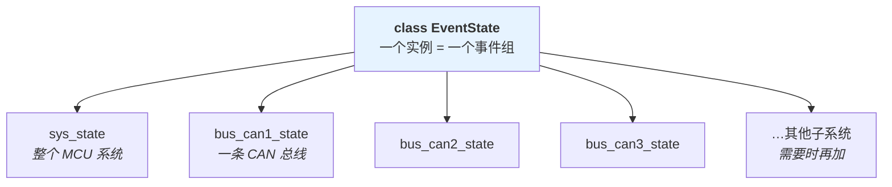

**收益**：一条总线的局部故障不再污染系统级的阶段判断。

0.4 版的问题链是：

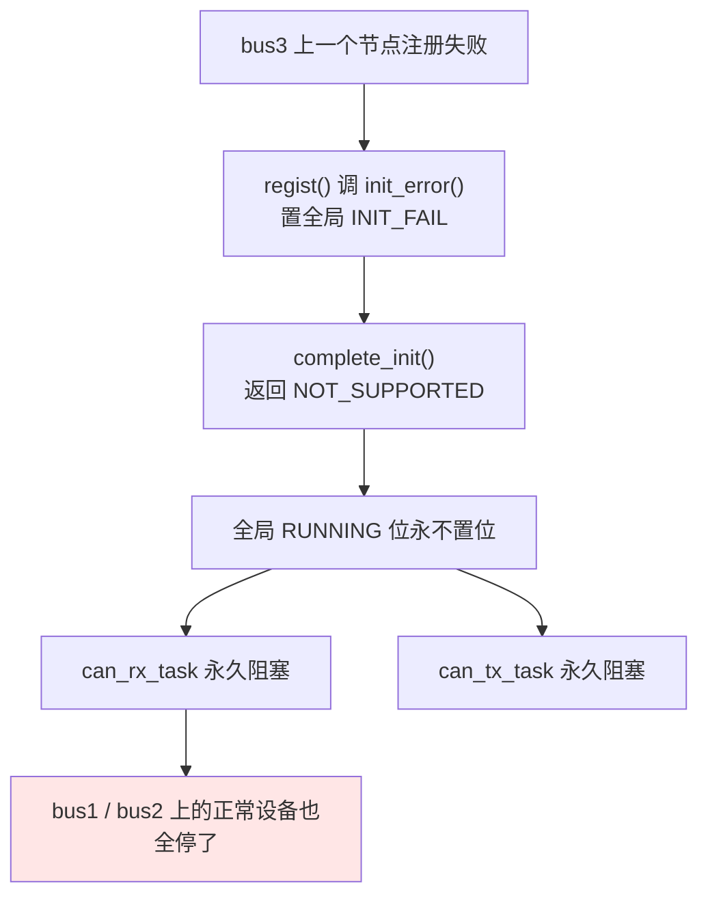

拆成实例之后，bus3 的失败只记在 `bus_can3_state` 上；要不要因此拖住整个系统，
变成 `all_init()` 里一行**显式策略**，而不是被全局位偷偷决定。

### 1.2 当前实例规划

| 实例 | 覆盖范围 | 状态 |
| --- | --- | --- |
| `sys_state` | 整个 MCU 系统 | **已落地**（`api_main.cpp`、各任务、CAN 节点注册器都在用） |
| `bus_can1_state` / `bus_can2_state` / `bus_can3_state` | 一条 CAN 总线 | **未落地** —— 等 CAN 总线改造第一步（帧表归总线）一起做 |
| 其他（UART、算法组等） | 按需 | 未落地 |

> 注：`EventState` 只是"一份阶段 + 一份错误登记"，它**不关心**被谁持有。
> 名字里的 `Event` 指它内部就是一个 FreeRTOS 事件组（24 位），`State` 指它只装状态、不装业务。

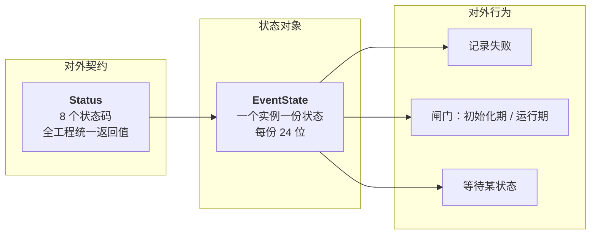

### 1.3 谁该用它、谁不该用

| 角色 | 该不该持有 `EventState` | 理由 |
| --- | --- | --- |
| **维护多个对象的系统**（CAN 总线、整个 MCU） | ✅ 该 | 它需要回答"这一组对象整体到什么阶段了、有没有出过错" |
| **单个设备**（一个电机、一个 IMU） | ❌ 不该 | 它只对自己负责，失败时把 `Status` 返回给调用方就够了 |

**单个设备不要把错误写进 `EventState`**：一个电机的初始化失败不应该直接让整机进入"初始化失败"态。
否则一条总线上一个节点出问题，`complete_init()` 就会拒绝置运行位，
所有任务都停在 `wait_running()` 上 —— 而它们本可以继续跑。

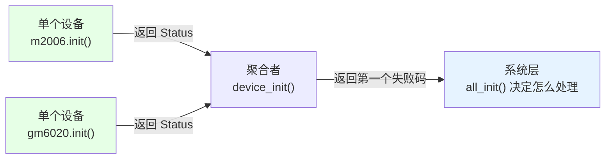

代码上的体现（2026-10-04 已改）：`User/Device/` 下的文件**不再引用 `sys_state` / `EventState`**，
`dji_motor.cpp` 的构造 / 析构 / `init()` 里原先的 6 处 `sys_state.*` 全部删掉，
`device_init()` 改为返回 `Status`，由 `all_init()` 的 `configASSERT` 决定怎么处理。

---

## 2. 它到底在解决什么问题

这不是"为了好看"而加的抽象。四个都是真实痛点。

### 痛点 1：`void` 初始化函数无法区分失败原因

```cpp
// 改造前：调用方拿不到任何信息
void can_bus_init(void);      // 内部打印一句就返回了
```

失败之后，**上面任何一层都问不出"到底为什么失败"**。要么在每个函数里加 `printf`，要么加一堆全局 flag。

`Status` 统一了返回值语义，失败码还能**沿调用链上抛**，最后落到 `sys_state.error_code()` 里可查。

### 痛点 2：运行期还在往注册表里挂节点

CAN 接收分发是在 `can_rx_task`（1 kHz）里**遍历单向链表**做的。链表的插入操作不是原子的 —— 如果一个设备对象在运行期析构/构造，正好被遍历线程撞上，就是**野指针**。

需要一道能挡住"运行期注册"的闸门。改造前用的是 `CanBus::frozen` 一个 `bool`，问题是：

- 它只挡 CAN 总线，挡不住别的层；
- 每个想加闸门的地方都得自己再定一个 flag。

### 痛点 3：设备初始化顺序是隐式耦合的

`all_init()` 里 `service_init()`（实例化 `sys_state` 并建事件组）必须第一个跑。这类约束**原先只写在注释里**，写错了就是运行时崩。

现在约束变成了**返回值**：事件组没建，`regist()` 直接返回 `nullptr`；系统已运行，`init()` 返回 `NOT_SUPPORTED`。顺序写错会**立刻、可定位地失败**，而不是走到某个奇怪的地方才崩。

### 痛点 4：没有"系统跑起来了"这个公共信号

任务创建后想等"全部初始化完成再开始干活"，改造前没有这个信号 —— 只能靠 `vTaskDelay(某个猜的时间)`。

`sys_state.wait_running()` 就是那个信号，语义精确，不需要猜时间。

---

## 3. 底层载体：为什么是 FreeRTOS 事件组

### 候选对比

| 载体 | 表达"多个失败同时存在" | 阻塞等待 | 内存 | 代价 |
| --- | --- | --- | --- | --- |
| 一组全局 `bool` | 要 N 个变量 | 不支持 | 最小 | 等待得靠轮询 |
| 全局位域 `uint32_t` | 支持 | 不支持 | 最小 | 同上；且跨任务无内存屏障 |
| 信号量 ×N | 要 N 个句柄 | 支持 | N × 句柄 | 想"一次等任意一个"很别扭 |
| **事件组** | **原生支持** | **原生支持** | **1 个结构体（堆上几十字节）** | 有控制位占用（高 8 位不可用） |

选事件组的决定性理由：**"一次等待多个条件中任意一个"和"一次等待多个条件全部满足"是同一套 API 的两个开关**，而这两种语义后面都用得上（等运行位、等某个失败位）。

### 24 位怎么来的

FreeRTOS 的事件组把**高 8 位**当成内部的控制字节：

```c
/* Middlewares/Third_Party/FreeRTOS/Source/include/event_groups.h:48 */
#define eventEVENT_BITS_CONTROL_BYTES    0xff000000UL   /* 32 位 tick 类型 */
```

所以一个 32 位事件组，**真正能给用户用的只有 bit 0 ~ bit 23，共 24 位**。这不是我定的规矩，是 FreeRTOS 的硬限制。任何 `uxBitsToWaitFor & 0xff000000` 非零的调用都会被 `configASSERT` 拦住。

> 本工程 `Core/Inc/FreeRTOSConfig.h:76` 中 `configUSE_16_BIT_TICKS = 0`，即 `configTICK_TYPE_WIDTH_IN_BITS = TICK_TYPE_WIDTH_32_BITS`（`FreeRTOS.h:80`），因此走的是 `0xff000000UL` 这条分支，**低 24 位可用**。

### 一个事件组的真实开销

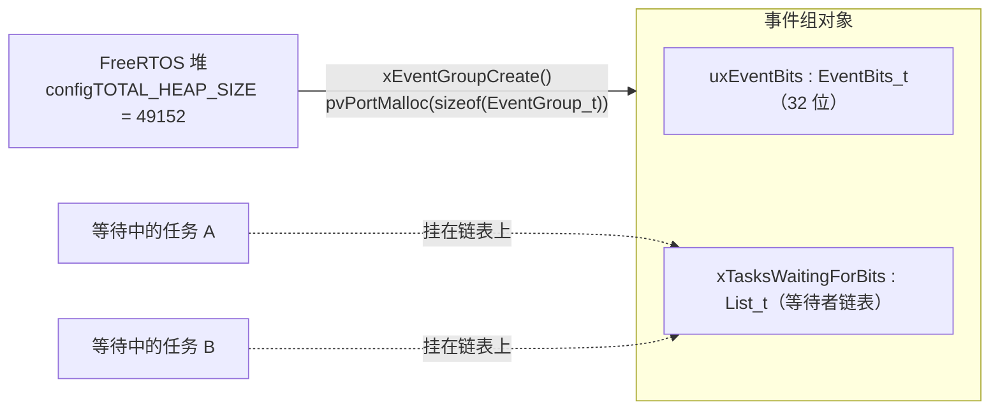

依据 `event_groups.c:49`：

```c
typedef struct EventGroupDef_t
{
    EventBits_t uxEventBits;          /* 那 24 个可用位就在这里 */
    List_t      xTasksWaitingForBits; /* 等待者的链表头 */
} EventGroup_t;
```

即：**不是队列，是一个直接 `pvPortMalloc` 出来的结构体**（`EventGroupHandle_t` 就是它的指针，`event_groups.h:103`）。代价是 FreeRTOS 堆上几十字节 —— **每个 `EventState` 实例一份**。

---

## 4. 位分配

**每个实例各有一份** 24 位。整个 24 位被切成三段，**段的边界是硬约定，由编译期断言守住**：

| 位 | 名称 | 含义 | 谁能置 | 谁能清 |
| --- | --- | --- | --- | --- |
| **0** | `Status::OK` 位 | "本实例到目前为止没有任何错误状态码" | `init()` | `set(非 OK)` |
| **1 ~ 21** | 状态码位 | 位号 = `Status` 枚举值。见下表 | `set()` | 无（粘滞） |
| **22** | `EventState::RUNNING_BIT` | 本实例已进入运行态 | `complete_init()` | `init_error()` |
| **23** | `EventState::INIT_FAIL_BIT` | 本实例初始化失败过 | `init_error()` | 无（粘滞） |

> 状态码位（bit 1~21）与失败位（bit 23）都**只置不清**，所以 `error_code()` 能一直回溯；
> 会被清的只有两处：bit 22（运行位）由 `init_error()` 清，bit 0（OK 位）由 `error()` 清
> —— bit 0 只是个“本实例还没记过错误”的标记，不算错误码。

### 状态码位逐位对照

| 位 | `Status` | 语义 | 谁把它记进事件组 |
| --- | --- | --- | --- |
| 0 | `OK` | 成功 | 通用 |
| 1 | `BUSY` | 资源被占用（重复注册、互斥量忙） | `can_tx_node.cpp` |
| 2 | `TIMEOUT` | 等待超时 | `Online` 的离线态 |
| 3 | `FULL` | 缓冲/链表/堆满 | `can_rx_node.cpp`、`can_tx_node.cpp`、`can_bus.cpp` |
| 4 | `IO_ERROR` | 硬件/传输错误 | 通用 |
| 5 | `BAD_ARG` | 参数非法 | `can_rx_node.cpp`、`can_tx_node.cpp` |
| 6 | `NOT_INIT` | 未初始化 | `CanTxNode` 初值 |
| 7 | `NOT_SUPPORTED` | 不支持的操作/当前阶段不允许 | 全部"运行期拒绝注册"分支 |

> 设备层（如 `dji_motor`）也会**返回**这些码，但不写进事件组 —— 见 §1.3。

**bit 8 ~ 21 目前空闲**，留作以后加状态码。

### 边界保护

```cpp
static constexpr uint32_t STATUS_MAX = 22U;   // EventState 的成员

static_assert(static_cast<uint32_t>(Status::NOT_SUPPORTED) < EventState::STATUS_MAX,
              "Status 取值与系统标志位重叠");
```

这条断言的意思是：**状态码最多只能用到 bit 21**。谁以后往 `Status` 里加第 15 个状态码还没有溢出，但加到撞上 bit 22（RUNNING）时，**编译直接失败**，而不是运行时两个语义静默打架。

用一张图看这 24 位：

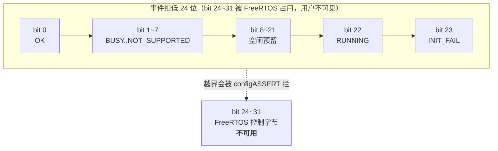

---

## 5. 三条设计原理

### 原理一：位号 = 枚举值 → 掩码是"移位"，反查是"扫一遍"

```cpp
enum class Status : uint8_t
{
  OK = 0, BUSY, TIMEOUT, FULL, IO_ERROR, BAD_ARG, NOT_INIT, NOT_SUPPORTED,
  /*            ↑ 隐式递增，值就是位号            */
};

constexpr uint32_t status_bit(Status statu)
{
  return 1U << static_cast<uint8_t>(statu);   // ← 枚举值 → 掩码，一条移位
}
```

**好处 1：不需要维护"枚举 ↔ 掩码"的映射表。** 加新状态码只要追加在末尾，掩码自动正确。

**好处 2：反查不需要表。** `error_code()` 直接按位号扫：

```cpp
const EventBits_t bits = xEventGroupGetBits(_handle);
for (uint32_t value = 1U; value < STATUS_MAX; ++value)
{
  if ((bits & (1U << value)) != 0U)
  {
    return static_cast<Status>(value);   // 位号 → 枚举值，一条转换
  }
}
return Status::OK;
```

`value` 直接就是 `Status` 的数值，**不需要 switch、不需要查表数组**。

**代价：枚举顺序变成了对外契约。** 重排 `Status` 的成员会改变位号，进而改变 `error_code()` 的返回值。这一点已经写进了 `status.hpp` 的注释里：

```cpp
/// @note 枚举值即事件组位号，因此**顺序不可随意调整**。
```

**顺带的副产物：`error_code()` 返回的是"枚举值最小的那个错误"。** 因为循环从 1 往上扫到 21，第一个命中的就是数值最小的位。这是个**确定性**行为（不是随机的"最后一个错误"），好处是同样的失败组合永远得到同一个答案，便于对比日志。

### 原理二：失败位是"粘滞"的（latch）

`error_code()` 读的位**没有任何代码会清除**。这不是疏漏，是刻意的：

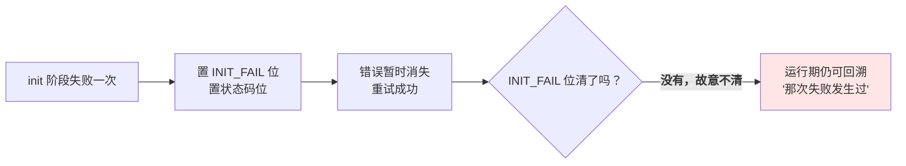

理由：初始化失败往往是**间歇性**的（总线暂无对端、上电时序、供电抖动）。如果清掉，运行期就再也查不到"刚才为什么起不来"。

对应地，`complete_init()` 会**拒绝**在失败位置位时置运行位：

```cpp
// 有失败记录说明初始化没走完整，不置运行位
if ((xEventGroupGetBits(_handle) & INIT_FAIL_BIT) != 0U)
{
  return Status::NOT_SUPPORTED;
}
```

这形成了一条**单向闸门**：失败一旦发生过，本实例就不会假装自己是健康的。

### 原理三：运行位当"系统阶段"的信号，而不是"成功"的信号

这是整个模块**最有实用价值**的一条，也是被引用最多的一条。

```cpp
bool EventState::running(void) const
{
  return is_ready() && ((xEventGroupGetBits(_handle) & RUNNING_BIT) != 0U);
}
```

它的语义是"**初始化阶段已经结束了**"，被当成**写权限的开关**用。全工程所有"只许初始化期做"的动作，第一行都是：

```cpp
if (sys_state.running())
{
  return Status::NOT_SUPPORTED;   // 运行期，拒绝
}
```

被它守住的写操作：

| 写操作 | 位置 | 为什么运行期不能做 |
| --- | --- | --- |
| 注册 CAN 接收节点（链表头插） | `can_rx_node.cpp::regist()` | 分发任务正在遍历这条链表 |
| 注销 CAN 接收节点（链表摘除 + `delete`） | `can_rx_node.cpp::unregist()` | 同上 |
| 注册 CAN 发送节点 | `can_tx_node.cpp::regist()` | 发送任务正在遍历这条链表 |
| 挂 TX 节点到总线 | `can_tx_node.cpp::CanTxNode::init()` | 同上 |

**一个 `running()` 守住了 4 类写操作**，这就是"把闸门提到 Service 层"换来的收益 —— 不需要每个模块自己定义 `xxx_frozen`。

而且这个闸门**跟着实例走**：将来给每条总线各配一个 `EventState`，`regist()` 只需要问本总线那一个实例，不必再去问全局。

> 单设备的构造 / `init()` 不在此表：注册链表的是 `regist()`，它自己会拒。
> 设备不需要为这个规矩写额外代码（详见 §1.3）。

---

## 6. 生命周期状态机

每个实例一个事件组句柄，它的状态就是这个实例的阶段。

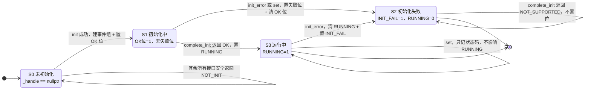

几个值得注意的边：

| 边 | 含义 |
| --- | --- |
| `S0 → S0` | 事件组未建时**所有接口都不崩** —— 这是整个模块的防御底线 |
| `S1 → S2` | 一旦有一个失败，本实例**不可能**再走到 `S3`（除非人工干预，但没有清除接口） |
| `S3 → S2` | 运行期 `init_error()` 会把本实例**拉回"失败"态**，运行位被清 → 各任务循环里的 `if (sys_state.running())` 随即停止干活 |
| `S3 → S3` | 运行期普通错误（如 `rx_poll` 里缓冲满）**只记状态码，不打断运行** |

最后一行是刻意的分级：

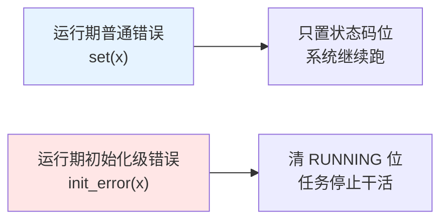

---

## 7. 初始化时序与任务闸门

`all_init()` 是整个流程的舞台。下面这张图把**"谁在等谁"**画出来：

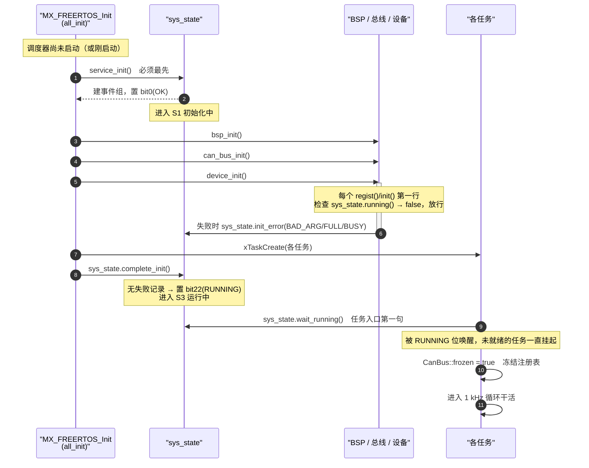

### 关键点：任务在门口"排队"

`sys_state.wait_running()` 让所有任务**在 RUNNING 位置之前一行代码都不执行**：

```cpp
extern "C" void can_rx_task(void *argument)
{
  (void)argument;
  sys_state.wait_running();         // ← 第一句，阻塞直到初始化完成
  CanBus::frozen = true;            // ← 第二句，冻结注册表
  static_assert(configTICK_RATE_HZ == 1000U, "can_rx_task requires a 1 kHz tick");
  ...
}
```

这解决了**痛点 4**：任务由 `xTaskCreate` 创建后立即进入就绪态，如果不等，它可能在 `device_init()` 还没跑完时就开始遍历空链表 —— 不会崩，但会漏掉前期数据，且行为和时序相关（最难查的那类 bug）。

用甘特图看时间轴：

```mermaid
gantt
    title 系统启动阶段（时间轴示意，非实测量）
    dateFormat X
    axisFormat %s

    section main
    service_init            :done, a1, 0, 1
    bsp_init                :done, a2, 1, 4
    can_bus_init            :done, a3, 4, 6
    device_init             :done, a4, 6, 12
    创建任务                :done, a5, 12, 13
    sys_state.complete_init :crit, done, a6, 13, 14

    section sys_state
    S1 初始化中             :active, b1, 1, 13
    S3 运行中               :crit, b2, 14, 40

    section can_rx_task
    阻塞在 wait_running     :active, c1, 12, 14
    冻结注册表 + 1kHz 循环   :crit, c2, 14, 40

    section 设备写注册表
    允许（S1）              :done, d1, 6, 13
    禁止（S3）              :crit, d2, 14, 40
```

---

## 8. 运行期闸门：为什么需要它

### 数据结构暴露面

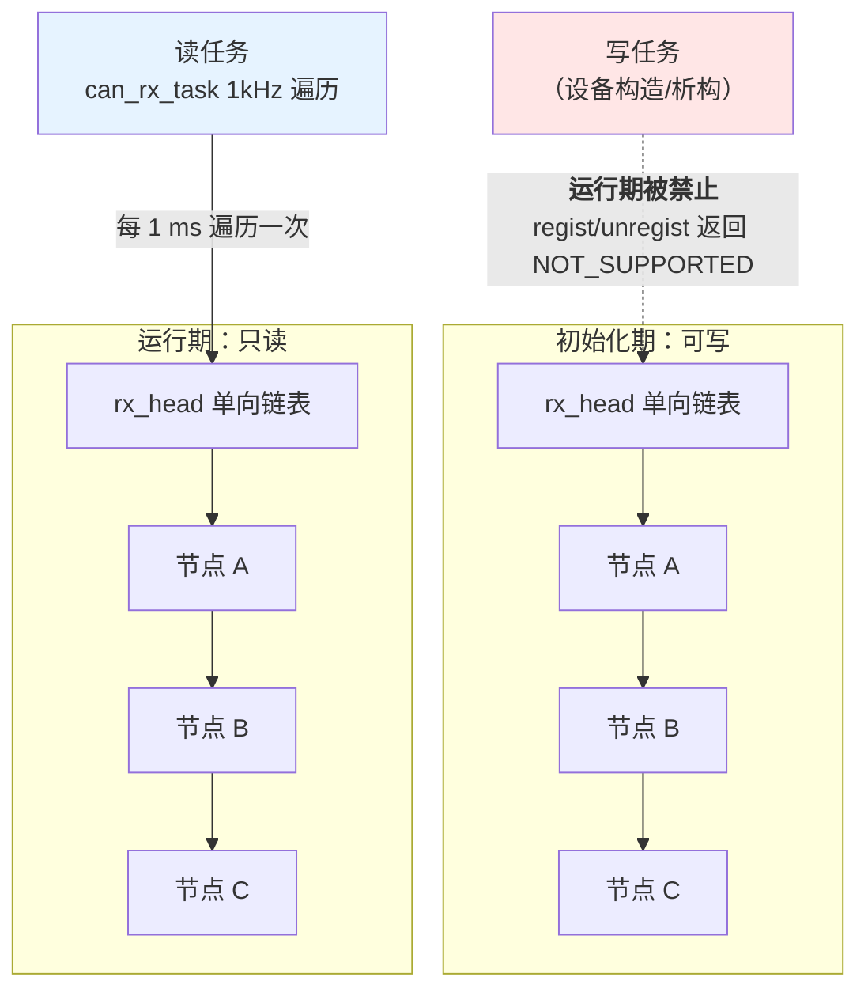

如果运行期允许 `delete node`，`can_rx_task` 正在 `node = node->next` 的那一瞬间，`next` 已经被 `delete` 释放 —— 典型的 **use-after-free**。这类 bug 在 STM32 上通常表现为**偶发的 HardFault**，极难复现。

### 三种"防"的手段，为什么选返回值

| 手段 | 做法 | 问题 |
| --- | --- | --- |
| 关中断/关调度 | 写时 `taskENTER_CRITICAL()` | 遍历是每次 1 ms，写操作在别的上下文，锁粒度对不上 |
| 引用计数 / RCU | 节点延迟回收 | 复杂度远超收益，嵌入式没这个必要 |
| **阶段闸门** | 写操作只在初始化期允许 | **实现成本 1 行 `if`** |

选第三条的原因很简单：**系统本来就不需要在运行期注册设备**。设备是编译期就确定的。既然"运行期注册"这个需求根本不存在，那就不该为它设计同步机制，而应该**禁掉它**。

> 这也解释了为什么 `CanBus::frozen` 现在可以删掉 —— 它的职责（防运行期注册）已经被 `sys_state.running()` 完全覆盖，且覆盖得更广。（见 `Docs/plan/CAN总线改造实施计划.md` 决策 20）

---

## 9. 错误传播链路

一次节点注册失败（发生在 Service 层），信息是怎么一路走到"可查询"的：

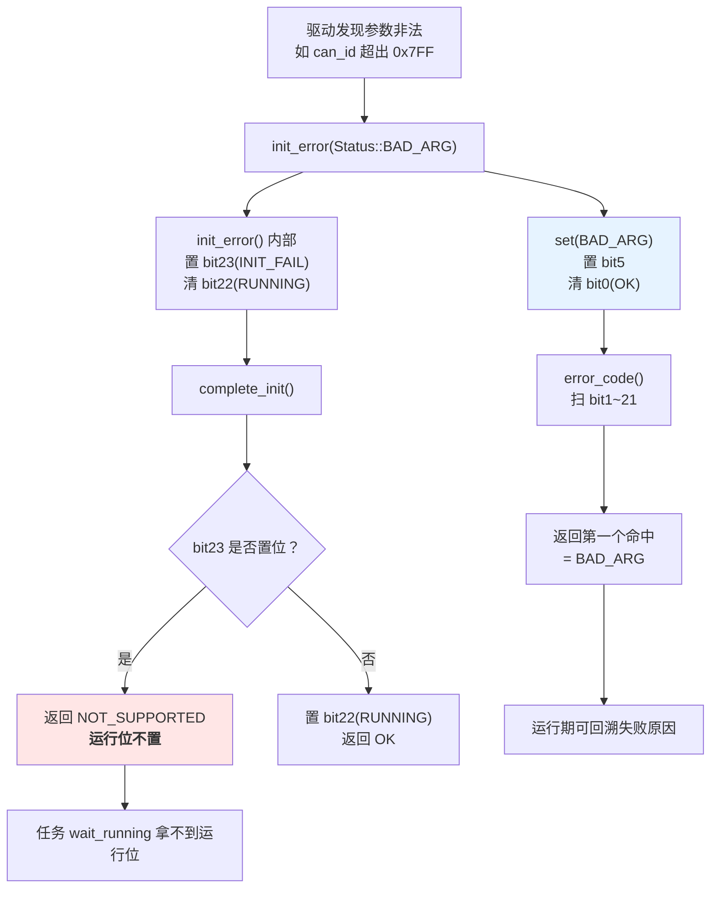

### 反向例：运行期普通错误不影响运行


**两次错误的差别只有一点：是否调用了 `init_error()`。** 这就是"初始化级错误"和"运行级错误"在代码上的唯一分界。

---

## 10. API 契约总表

所有接口都是 `EventState` 的成员函数；`sys_state` 是全局实例。

### 返回值语义

| 返回值 | 出现场合 |
| --- | --- |
| `Status::OK` | 操作成功，或"查询结果正常" |
| `Status::NOT_INIT` | 本实例尚未调用 `init()` |
| `Status::BAD_ARG` | 给 `set()` 传了 `Status::OK` |
| `Status::FULL` | `xEventGroupCreate()` 分配失败 |
| `Status::NOT_SUPPORTED` | 已有失败记录，拒绝置运行位 |
| `bool` / `uint32_t` | 纯查询接口 |

### 逐方法契约

| 方法 | 参数 | 返回 | 未 init 时 | 副作用 | 调用时机 |
| --- | --- | --- | --- | --- | --- |
| `init()` | — | `OK` / `FULL` | 创建 | 建事件组，置 OK 位 | **最先**，仅一次（幂等） |
| `complete_init()` | — | `OK`/`NOT_SUPPORTED`/`NOT_INIT` | `NOT_INIT` | 置 RUNNING 位 | 初始化末尾一次 |
| `error(s)` | 状态码 ≠ OK | `OK`/`BAD_ARG`/`NOT_INIT` | `NOT_INIT` | 置 s 位，清 OK 位 | 任意（运行期错误，不动运行位） |
| `init_error(s)` | 状态码 | `error()` 的结果 | `NOT_INIT` | 置 INIT_FAIL、清 RUNNING、再记错误码 | 初始化失败处 |
| `is_ready()` | — | `bool` | `false` | 无 | 任意（用于收口裸句柄检查） |
| `running()` | — | `bool` | `false` | 无 | 任意（热路径安全） |
| `error_code()` | — | `Status` | `NOT_INIT` | 无 | 任意 |
| `wait_running()` | — | `void` | **删除当前任务** | 阻塞直到 RUNNING 或 INIT_FAIL | **仅任务中** |

### `init_error()` 里的置位顺序

```cpp
Status EventState::init_error(Status statu)
{
  if (_handle == nullptr)
  {
    return Status::NOT_INIT;
  }
  // INIT_FAIL 与 RUNNING 先处理完再记错误码：失败位置位就一定已经停掉了运行位
  (void)xEventGroupSetBits(_handle, INIT_FAIL_BIT);
  (void)xEventGroupClearBits(_handle, RUNNING_BIT);
  return error(statu);
}
```

顺序有讲究：先把 INIT_FAIL 与 RUNNING 处理完（**立刻停掉本实例的运行期动作**），再置状态码记录原因。

而且这两行紧贴在一起带来了一个**不变式**：只要失败位置位，就一定已经有一个错误码可查。
0.4 版曾是个缺口 —— 无参的 `sys_init_error()` 是公开接口，只置 INIT_FAIL 不置状态码，
于是会出现 `init_failed() == true` 但 `init_result() == OK` 的自相矛盾。0.5 版把它并入了
`init_error(Status)` 的实现里；0.6 版更直接把两个查询合成一个 `error_code()`，连提出矛盾的机会都没有了。

---

## 11. 工程内的实际调用点

> 行号以本次改造（2026-10-04）后为准；后续如有改动，请按符号名搜索而不是按行号。

### 写入方（谁在记录）

| 位置 | 调用 | 阶段 | 触发条件 |
| --- | --- | --- | --- |
| `service_cfg.cpp` | `service_init()` 内部调 `sys_state.init()` | 最先 | 启动自检（`api_main.cpp` 断言其返回 `OK`） |
| `can_rx_node.cpp:22` | `init_error(BAD_ARG)` | 初始化 | callback 为空 / 总线未就绪 / ID 越界 |
| `can_rx_node.cpp:29` | `init_error(BUSY)` | 初始化 | 同一总线同一 ID 重复注册 |
| `can_rx_node.cpp:35,41` | `init_error(FULL)` | 初始化 | 节点数超 50 / `new` 失败 |
| `can_tx_node.cpp:45` | `init_error(_statu)` | 初始化 | 构造参数非法（division、can_id） |
| `can_tx_node.cpp:52` | `init_error(FULL)` | 初始化 | 创建互斥量失败 |
| `can_tx_node.cpp:94` | `init_error(BAD_ARG)` | 初始化 | 槽位/division/can_id 不合法 |
| `can_tx_node.cpp:110,119` | `init_error(FULL)` | 初始化 | 槽位冲突 / 节点数超限 |
| `can_tx_node.cpp:125` | `init_error(BUSY)` | 初始化 | `new` 失败 |
| `can_bus.cpp:114` | `error(Status::FULL)` | 运行期 | 回退缓冲满 |

> 设备层（`Device/`）**不写本状态**：单设备只把 `Status` 返回给 `device_init()`，
> 失败的具体原因由上面的注册器记录。见 §1.3。

### 闸门方（谁在被挡）

| 位置 | 检查 | 拒绝方式 |
| --- | --- | --- |
| `can_rx_node.cpp:16` | `!is_ready() \|\| frozen \|\| running()` | 返回 `nullptr` |
| `can_rx_node.cpp:52` | `frozen \|\| running()`（`unregist`） | 返回 `NOT_SUPPORTED` |
| `can_tx_node.cpp:31` | `running()` | 返回 `NOT_SUPPORTED` |
| `can_tx_node.cpp:82` | `!is_ready()` | 返回 `nullptr` |
| `can_tx_node.cpp:86` | `frozen \|\| running()` | 返回 `nullptr` + 置 `frozen` |

> `dji_motor` 曾经也在这里查 `sys_state`（旧行号 117 / 190 / 194）。
> 按 §1.3 的原则已删：单设备不需要自己挡，`regist()` 会拒。

### 任务方（谁在门口等）

| 位置 | 调用 |
| --- | --- |
| `can_bus.cpp:178`（`can_rx_task`） | `sys_state.wait_running()` |
| `can_bus.cpp:204`（`can_tx_task`） | `sys_state.wait_running()` |
| `can_recovery_test.cpp:210` | `sys_state.wait_running()` |
| `can3_device_test.cpp:147` | `sys_state.wait_running()` |

### 运行期心跳检查

| 位置 | 调用 |
| --- | --- |
| `can_bus.cpp:185`（`can_rx_task` 循环） | `if (sys_state.running())` |

### 目前**没有调用点**的接口

| 接口 | 状态 |
| --- | --- |
| `sys_state.error_code()` | 已实现，暂无调用方（留作运行期上报/调试显示） |

---

## 12. 使用示例

### 12.1 初始化阶段（`all_init()` 骨架）

```cpp
void all_init()
{
  /* 1. 必须最先：建事件组。失败直接停在断言上 */
  configASSERT(service_init() == Status::OK);

  /* 2. 各层初始化，失败就上报（也能直接由 init() 内部上报） */
  bsp_init();
  if (can_bus_init() != Status::OK)
  {
    sys_state.init_error(Status::IO_ERROR);
  }
  device_init();

  /* 3. 创建任务：任务入口第一句都会等运行态 */
  configASSERT(xTaskCreate(can_rx_task, "can_rx", 512, NULL, tskIDLE_PRIORITY + 8, NULL) == pdPASS);
  configASSERT(xTaskCreate(can_tx_task, "can_tx", 512, NULL, tskIDLE_PRIORITY + 8, NULL) == pdPASS);

  /* 4. 全部完成：置运行位。有失败记录则返回 NOT_SUPPORTED 且不置位 */
  (void)sys_state.complete_init();
}
```

### 12.2 任务入口（门口排队）

```cpp
extern "C" void can_rx_task(void *argument)
{
  (void)argument;
  sys_state.wait_running();       // 阻塞直到 S3；未 init 或初始化失败则删掉自己
  CanBus::frozen = true;          // 此刻起注册表只读
  static_assert(configTICK_RATE_HZ == 1000U, "can_rx_task requires a 1 kHz tick");

  TickType_t wake_time = xTaskGetTickCount();
  for (;;)
  {
    if (sys_state.running())      // 运行期被 init_error() 打断时自动停手
    {
      for (uint32_t i = 0; i < CanBus::BUS_NUM; ++i)
      {
        CanBus::buses[i]->rx_poll();
      }
    }
    vTaskDelayUntil(&wake_time, pdMS_TO_TICKS(1U));
  }
}
```

### 12.3 设备初始化（只返回 Status，不写全局状态）

```cpp
Status DjiMotor<type>::init()
{
  if (_statu == Status::OK)
  {
    return Status::OK;            // 幂等：重复调用无副作用
  }
  if (_statu != Status::NOT_INIT)
  {
    return _statu;                // 构造期已判定的参数错误
  }

  _data_mutex = xSemaphoreCreateMutex();
  if (_data_mutex == nullptr)
  {
    _statu = Status::FULL;
    return _statu;                // 交给调用方，本层不写全局状态
  }

  _tx_node = regist({_can_item, tx_id, 4U}, _bus_slot);
  if (_tx_node == nullptr)
  {
    /* 具体原因已由注册器（Service 层）记进状态 */
    vSemaphoreDelete(_data_mutex);
    _data_mutex = nullptr;
    _statu      = Status::FULL;
    return _statu;
  }
  /* ... 注册接收节点 ... */
  _statu = Status::OK;
  return Status::OK;
}
```

调用方（`device_cfg.cpp`）汇总后返回，由上层决定怎么处理：

```cpp
Status device_init()
{
  const Status m2006_state = m2006.init(); // 注册 0x200 槽位 0 + 反馈节点 0x201
  if (m2006_state != Status::OK)
  {
    return m2006_state;
  }
  return gm6020.init(); // 注册 0x1FE 槽位 0 + 反馈节点 0x205
}
```

### 12.4 运行期查询

```cpp
/* 本实例出过什么错（枚举值最小的那个） */
const Status fail = sys_state.error_code();
if (fail != Status::OK)
{
  /* OK      = 从未记录过错误
   * NOT_INIT= 事件组都没建起来
   * 其余    = 第一个（枚举值最小的）错误码 */
}
```

### 12.5 关于通用等待

0.5 版提供一个通用等待 `wait(Status, ticks)`（等任意状态位），但工程内**零调用点**，
已调用方真正需要的是“等本实例进入运行态”。0.6 版把这个函数删掉，只留 `wait_running()`：
接口少一个，行为无变化。确实需要通用等待时再从 git 历史里取回。

---

## 13. 防御性设计

### 13.1 空句柄安全

除了 `init()`，**每一个成员函数**都在最前面处理了 `_handle == nullptr`：

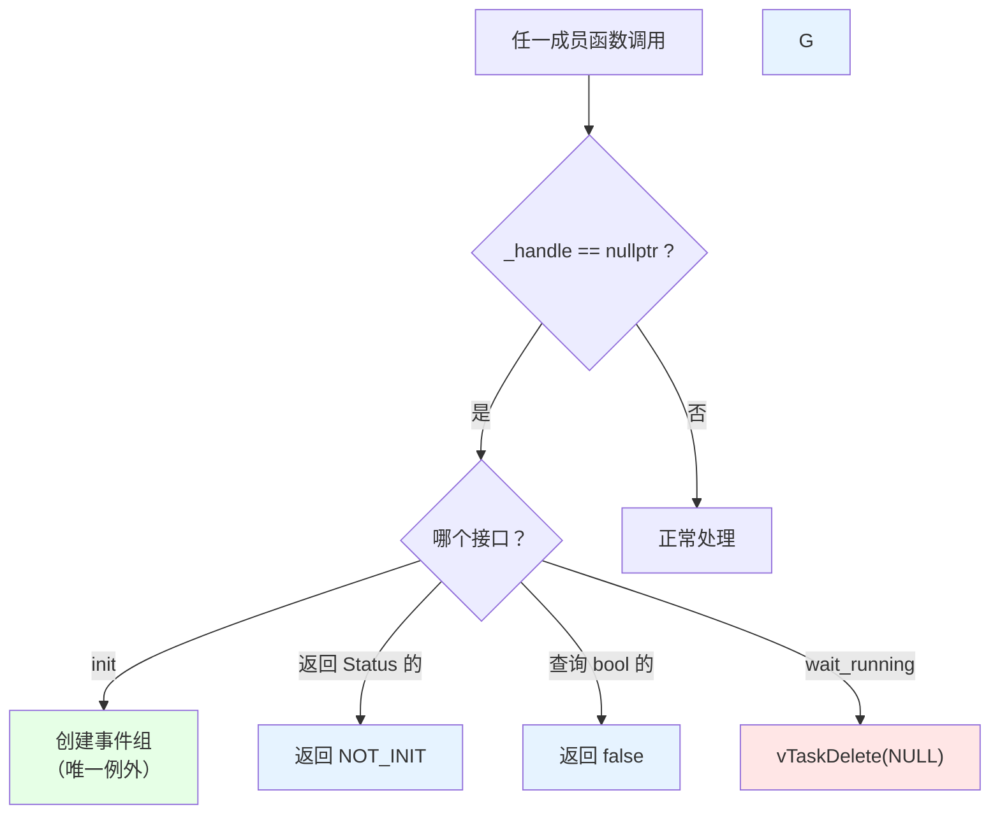

0.4 版的 `sys_init_error()` 与 `sys_complete_init()` **没有**这个保护，直接对空句柄调用 `xEventGroupSetBits()` —— 会踩进 FreeRTOS 的 `configASSERT` 或更糟。0.5 版两个都已加上。

### 13.2 幂等

```cpp
Status EventState::init(void)
{
  if (_handle != nullptr)
  {
    return Status::OK;   // 已建过 → 直接返回，不重建
  }
  _handle = xEventGroupCreate();
  ...
}
```

**不幂等的代价是句柄泄漏**：每次重复调用都会 `xEventGroupCreate()` 一个新句柄，旧句柄无人释放。虽然正常流程只调一次，但"只调一次"这种约定在重构中最容易破。

同样的幂等性也做在设备层：`DjiMotor::init()` 在 `_statu == Status::OK` 时直接返回 `OK`，不重复申请互斥量、不重复注册节点，也**不重复记系统错误**。

### 13.3 编译期断言

```cpp
static_assert(static_cast<uint32_t>(Status::NOT_SUPPORTED) < EventState::STATUS_MAX,
              "Status 取值与系统标志位重叠");
```

把"状态码与系统标志位不能重叠"这个**运行时语义约束**提升到编译期。

### 13.4 `constexpr` 掩码

`status_bit()` 是 `constexpr`，因此：

- 编译期就能算 `status_bit(Status::OK)` → 常量 1；
- 可以被 `static_assert`、常量表达式、`case` 标签使用；
- 没有运行时开销。

### 13.5 析构释放

`~EventState()` 会 `vEventGroupDelete(_handle)`。虽然全局实例在 MCU 上永远不会析构，但保持 RAII 一致——
而且这是「可以直接删掉析构函数」与「类持有资源就应该释放」之间的一个取向。
实测代价：链接进 `vEventGroupDelete`（138 B）+ 一条析构注册（`.init_array` +16 B），
连同其他改动共 **+260 B FLASH**（0.6 版删掉零调用点的 `wait()`、并把设备层对状态的所有引用清掉，
从 +484 降到 +260）。若不需要可删掉析构函数换回这局部空间。

---

## 14. 与 `Online` 的关系

两者**共用 `Status` 枚举**，但**语义完全不同**，很容易混：

| | `status` 模块（`EventState`） | `Online` 类 |
| --- | --- | --- |
| 作用对象 | **可多实例**（当前只创建了全局 `sys_state` 一个） | **单个设备实例**（每个 `Online` 独立） |
| 时间尺度 | 一次性（开机） | 周期性（超时刷新） |
| `Status::OK` | "登记表中没有错误码" | "该设备反馈在超时窗口内" |
| `Status::TIMEOUT` | 等待超时（通用语义） | **离线** |
| 状态存放 | 事件组位 | 成员 `_statu` |
| 谁更新 | `EventState` 的成员函数 | `Online::update()`，由 `sys_task` 10 ms 驱动 |
| 复位方式 | 无（粘滞） | 设备自己 `refresh()` 即回到 `OK` |

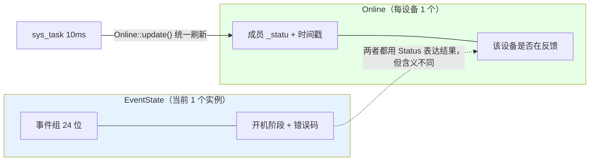

**唯一需要注意的坑**：`Status::TIMEOUT` 在系统级表示"某次等待超时"，在设备级表示"设备离线"。同一个枚举值在两处**含义不同**，读代码时要看上下文。

---

## 15. 已知局限与待决问题

> 下面都是**当前代码的真实状态**，不是"以后优化"的空话。
> 0.5 版修掉了 0.4 版的三个问题，过程留在这一节备查。

### 15.1 已修：`wait_running()` 的失败退出路径

0.4 版：

```cpp
void sys_flag_wait_running(void)
{
  ...
  (void)xEventGroupWaitBits(sys_event, SYS_FLAG_RUNNING_BIT, pdFALSE, pdTRUE, portMAX_DELAY);
  if (!sys_flag_running())
  {
    vTaskDelete(NULL);   // ← 事实上很难到达
  }
}
```

问题：`portMAX_DELAY` 是**无限等待**（`FreeRTOSConfig.h:114` 的 `INCLUDE_vTaskSuspend = 1` 让该分支不会被有限超时截断），而初始化失败时 `RUNNING` 位**永远不会被置**（`complete_init()` 返回 `NOT_SUPPORTED`）。于是：

- 头文件里写的"初始化失败则任务自行退出" **不会发生**；
- 任务会**永远阻塞**在 `xEventGroupWaitBits()`；
- 末尾那个 `if (!sys_flag_running())` 只能覆盖"运行位刚置上又被 `init_error()` 清掉"这个很窄的竞态。

0.5 版改成等「运行位**或**失败位任意一个」，行为与注释一致：

```cpp
void EventState::wait_running(void) const
{
  if (_handle == nullptr) { vTaskDelete(NULL); return; }

  // xWaitForAllBits=pdFALSE → 任一满足即返回
  const EventBits_t bits = xEventGroupWaitBits(_handle, RUNNING_BIT | INIT_FAIL_BIT, pdFALSE, pdFALSE, portMAX_DELAY);
  if ((bits & RUNNING_BIT) == 0U)
  {
    vTaskDelete(NULL); // 初始化失败：任务自行退出
  }
}
```

> **这是一次行为变更**：以前初始化失败时任务永久挂起，现在任务会删掉自己。
> 两种做法都不会让系统真的跑起来，但"删掉自己"与头文件承诺一致，且不会留下一个永远不会被唤醒的任务占着栈。
> 若要改回"失败时永久挂起"，把 `RUNNING_BIT | INIT_FAIL_BIT` 换回 `RUNNING_BIT` 即可。

### 15.2 已修：两个失败查询会自相矛盾

0.4 版同时提供 `init_result()`（最小失败码）与 `init_failed()`（失败位是否置位）两个公开查询。
而公开的无参 `sys_init_error()` 只置 `INIT_FAIL`、不置状态码位，于是会出现：

```
init_failed() == true     // INIT_FAIL 位已置
init_result() == OK       // 扫不到任何状态码位
```

0.5 版把无参版本并入了 `init_error(Status)`；**0.6 版直接把两个查询合成一个 `error_code()`** ——
只返回最小错误码，无错误时返回 `OK`。两个查询互相矛盾这件事在接口层面就不存在了。

### 15.3 已修：2 处直接读全局句柄

0.4 版有 4 处把 `extern` 全局句柄当"是否就绪"用（其中 2 处在 `dji_motor.cpp`）：

```cpp
// can_rx_node.cpp:16
if (sys_event == nullptr || CanBus::frozen || sys_flag_running() || cfg.bus == nullptr)
// can_tx_node.cpp:82
if (sys_event == nullptr || cfg.bus == nullptr)
// dji_motor.cpp:117 / 190（已按 §1.3 整处删掉）
if (sys_event != nullptr && sys_flag_running())
if (sys_event == nullptr)
```

0.5 版把 `_handle` 变成 `EventState` 的私有成员（句柄不再对外可见），并加了一个就绪查询
（0.5 叫 `inited()`，0.6 改名 `is_ready()`）；0.6 又把剩下 2 处留在 Service 层，保持单设备无依赖：

```cpp
if (!sys_state.is_ready() || CanBus::frozen || sys_state.running() || cfg.bus == nullptr)
if (!sys_state.is_ready() || cfg.bus == nullptr)
```

**句柄泄漏被结构性地堵住了**：外部代码再没有途径直接操作事件组。

### 15.4 未决：per-bus 实例还没落地

`EventState` 支持多实例，但目前只创建了 `sys_state` 一个。三条总线各一个实例（`bus_can1_state` / `bus_can2_state` / `bus_can3_state`）**尚未落地**，原因是它会和 CAN 总线改造第一步（帧表归总线）动同一批文件，分两次改等于做两遍。

落地后的目标形态：

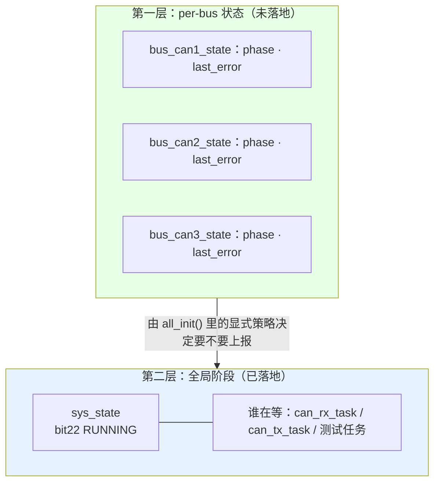

### 15.5 未决：`Status` 枚举值被当成位号

`status_bit()` 依赖"枚举值 = 位号"。好处是零映射表，代价是**枚举顺序变成对外契约**。目前没有机制阻止有人重排 `Status` —— 编译期断言只能挡住"值过大"，挡不住"换位置"。

### 15.6 验证状态

| 项目 | 状态 |
| --- | --- |
| 编译 | **通过**（0 warning / 0 error，`cmake --build build/Debug`） |
| 主机测试 | `User/App/test/can/test_recovery_host.py` PASS |
| FLASH 占用 | 121576 B → **121836 B**（+260 B，含 `vEventGroupDelete` 138 B 与析构注册） |
| **实机验证** | **未验证** —— 从未烧录，从未观察过串口输出 |
| `sys_state.error_code()` | 无调用点，未被执行过 |

---

## 16. 总结

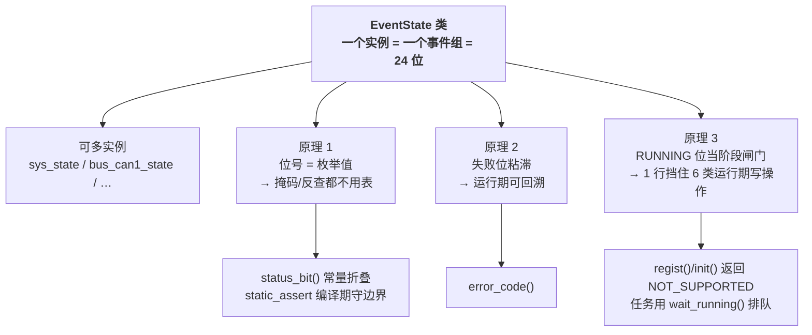

三条原理各自解决一个具体问题，共同点是：**用最小的机制（一个 32 位事件组）同时提供"记录"和"同步"两种能力**，而且这份能力可以按子系统复制多份。

代价是三条必须记住的约定：

1. **`Status` 枚举顺序不能改** —— 值就是位号；
2. **状态码不得越过 bit 21** —— 由 `static_assert` 兜住；
3. **`init()` 必须最先调用** —— 否则后续所有操作返回 `NOT_INIT`。

---

## 相关文档

- [编码规范](../spec/编码规范.md)
- [分层架构](../spec/分层架构.md)
- [CAN 总线改造实施计划](../plan/CAN总线改造实施计划.md)（决策 20：删 `CanBus::frozen`，由本模块接管）
- 代码：`User/Service/status.hpp`、`User/Service/status.cpp`
