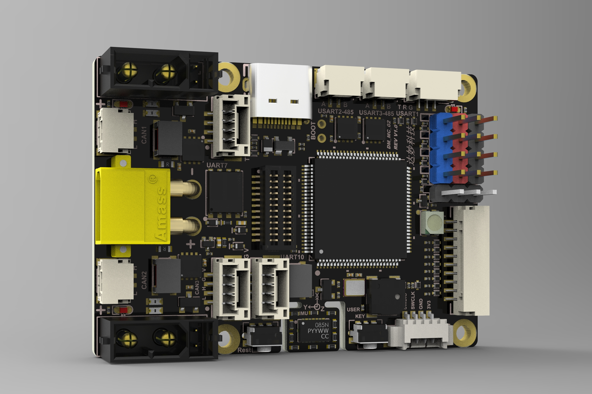
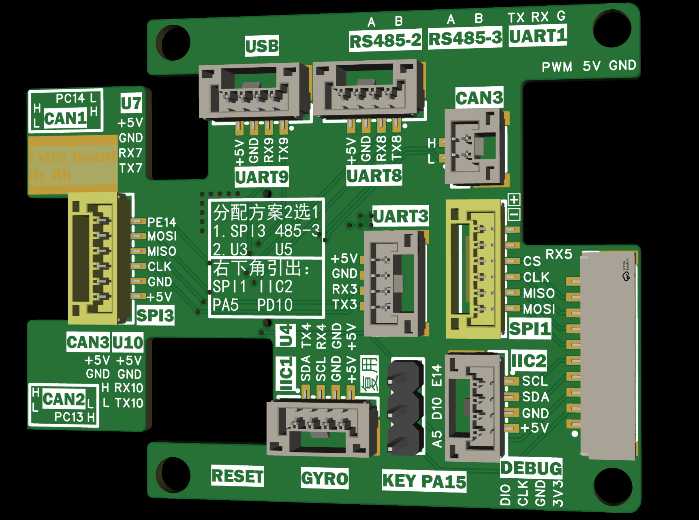

# 引脚分配与冲突

## 本工程采用的引脚冲突分配方案（✅ 采用 / ❌ 暂不采用）

| 引脚      | 情况     | 方案  | 采用 | 说明             |
| --------- | -------- | ----- | ---- | ---------------- |
| PB8 / PB9 | 引脚复用 | UART4 | ✅    | 本工程保留 UART4 |
| PB8 / PB9 | 引脚复用 | IIC1  | ❌    |                  |

| 引脚               | 情况   | 方案         | 采用 | 说明                    |
| ------------------ | ------ | ------------ | ---- | ----------------------- |
| PC10 / PC11 / PC12 | 二选一 | SPI3 RS485-3 | ❌    |                         |
| PC10 / PC11 / PC12 | 二选一 | UART3 UART5  | ✅    | UART5 作 SBUS（仅接收） |

## 本工程的引脚具体分配

上图的是板子的一层和二层的外观

## 引脚分配表

引脚与信号取自 `DM_MC02.ioc`；「代码实例」是 `User/Bsp/bsp_cfg.cpp` 里对应的全局实例。

### 串口

所有引出的串口在板上都是同一种 **GH1.25-4PIN** 座子，脚序一致。

| 外设    | TX   | RX   | 代码实例     | 说明                                                     |
| ------- | ---- | ---- | ------------ | -------------------------------------------------------- |
| USART1  | PA9  | PA10 | `bsp_uart1`  |                                                          |
| USART3  | PC10 | PC11 | `bsp_uart3`  | 与 SPI3 复用，本工程选 UART3                             |
| UART4   | PB9  | PB8  | `bsp_uart4`  |                                                          |
| UART5   | PC12 | PD2  | `bsp_uart5`  | **SBUS**；仅接收（未配 TX DMA，`transmit_enable=false`） |
| UART7   | PE8  | PE7  | `bsp_uart7`  |                                                          |
| UART8   | PE1  | PE0  | `bsp_uart8`  |                                                          |
| UART9   | PD15 | PD14 | `bsp_uart9`  |                                                          |
| USART10 | PE3  | PE2  | `bsp_uart10` |                                                          |

### RS485-2（串口2）

| 引脚 | 信号      | 说明               |
| ---- | --------- | ------------------ |
| PD5  | USART2_TX | 接 RS485 收发器    |
| PD6  | USART2_RX | 接 RS485 收发器    |
| PD4  | USART2_DE | 硬件流控方向控制   |
| —    | A / B     | 板上已引出 A、B 相 |

代码里还没有 `bsp_uart2` 实例（`bsp_cfg.cpp` 目前只初始化上表中的 8 路串口）。

### CAN

正常引出，均为同一种 **GH1.25-2PIN** 座子，脚序一致。

| 外设   | RX   | TX   | 代码实例                | 当前接入                                                        |
| ------ | ---- | ---- | ----------------------- | --------------------------------------------------------------- |
| FDCAN1 | PD0  | PD1  | `bsp_can1` / `bus_can1` | —                                                               |
| FDCAN2 | PB5  | PB6  | `bsp_can2` / `bus_can2` | —                                                               |
| FDCAN3 | PD12 | PD13 | `bsp_can3` / `bus_can3` | M2006/C610（ID1）、GM6020（电流模式，ID1）、DM-IMU（`0x58`/`0x59`） |

### PWM 通道 ×6

| 引脚 | 定时器通道 | 代码实例         | 用途             |
| ---- | ---------- | ---------------- | ---------------- |
| PE13 | TIM1_CH3   | `bsp_pwm1`       | 舵机 `servo1`    |
| PE9  | TIM1_CH1   | `bsp_pwm2`       | 舵机 `servo2`    |
| PA2  | TIM2_CH3   | `bsp_pwm3`       | 舵机 `servo3`    |
| PA0  | TIM2_CH1   | `bsp_pwm4`       | 舵机 `servo4`    |
| PB1  | TIM3_CH4   | `bsp_pwm_gyro`   | 陀螺仪           |
| PB15 | TIM12_CH2  | `bsp_pwm_buzzer` | 无源蜂鸣器       |

> 定时器时钟 275 MHz（APB 137.5 MHz × 2），PSC/ARR 取自 CubeMX；`bsp_init()` 里先清 CCR
> 再启动，**上电全部 0% 占空比**。
> `bsp_pwm_buzzer` 由 Device 层 `buzzer`（`DeviceBuzzer`）驱动，提供音调 / 音量 / 鸣叫时长语义。
> 同一定时器的多个通道共用计数器与 ARR，PE9 与 PE13 必须同频。

### 原 LCD 接口：SPI1 + I2C2 + CS

原 LCD 接口改成一个 I2C、一个 SPI，剩下的作普通 GPIO，通过反向线延伸到二层。

| 用途      | 引脚 | 代码实例  | 说明                     |
| --------- | ---- | --------- | ------------------------ |
| SPI1_SCK  | PB3  | —         | 仅发送                   |
| SPI1_MOSI | PD7  | —         | 仅发送（simplex master） |
| SPI1_CS   | PE15 | `spi1_cs` | 片选                     |
| I2C2_SCL  | PB10 | —         | 已按 I2C2 配置           |
| I2C2_SDA  | PB11 | —         | 已按 I2C2 配置           |

> SPI1_MISO（PB4）未在 ioc 中配置。

### SPI2 陀螺仪

| 引脚 | 信号      | ioc 标签            | 说明                         |
| ---- | --------- | ------------------- | ---------------------------- |
| PB13 | SPI2_SCK  | —                   |                              |
| PC1  | SPI2_MOSI | —                   |                              |
| PC2  | SPI2_MISO | —                   |                              |
| PC0  | GPIO      | `GYRO_ACC_CS`       | 片选 0                       |
| PC3  | GPIO      | `GYRO_GYRO_CS`      | 片选 1                       |
| PE10 | GPXTI10   | `GYRO_ACC_INT`      | 中断 1                       |
| PE12 | GPXTI12   | `GYRO_GYRO_INT`     | 中断 3                       |
| PB1  | TIM3_CH4  | `PWM_GYRO_TIM3_CH4` | 陀螺仪相关，一并引算入GYRO中 |

### BTB 扩展 GPIO（3 个）

| 引脚 | ioc 标签   | 代码实例   |
| ---- | ---------- | ---------- |
| PA5  | `BTB_PA5`  | `btb_pa5`  |
| PE14 | `BTB_PE14` | `btb_pe14` |
| PD10 | `BTB_PD10` | `btb_pd10` |

### 电源使能 ×3

| 引脚 | ioc 标签      | 代码实例      |
| ---- | ------------- | ------------- |
| PC14 | `POWER_24V_1` | `power_24v_1` |
| PC13 | `POWER_24V_2` | `power_24v_2` |
| PC15 | `POWER_5V`    | `power_5v`    |

### QSPI Flash（W25Q64JV，OCTOSPI2）

> ioc 中已配置 OCTOSPI2 与下列引脚。

| 引脚 | 信号            |
| ---- | --------------- |
| PB2  | OCTOSPIM_P1_CLK |
| PE11 | OCTOSPIM_P1_NCS |
| PD11 | OCTOSPIM_P1_IO0 |
| PB0  | OCTOSPIM_P1_IO1 |
| PA3  | OCTOSPIM_P1_IO2 |
| PA1  | OCTOSPIM_P1_IO3 |

### 时钟、蜂鸣器与按键

| 用途     | 引脚     | ioc 标签               | 说明                    |
| -------- | -------- | ---------------------- | ----------------------- |
| 晶振     | PH0、PH1 | —                      | 24 MHz HSE              |
| 蜂鸣器   | PB15     | `PWM_Buzzer_TIM12_CH2` | 无源蜂鸣器（`bsp_pwm_buzzer` / `buzzer`） |
| 用户按键 | PA15     | `KEY`                  | GPXTI15，纯软件轮询消抖 |

### 其他

| 用途   | 引脚       | ioc 标签 | 说明                                |
| ------ | ---------- | -------- | ----------------------------------- |
| USB    | PA11、PA12 | —        | USB_OTG_HS DM / DP，Device_Only_FS  |
| 调试   | PA13、PA14 | —        | SWDIO / SWCLK                       |
| ws2812 | PA7        | —        | TIM14_CH1；被结构件遮挡，**不使用** |

除上面列出的以外，其余引脚均为正常引出。
