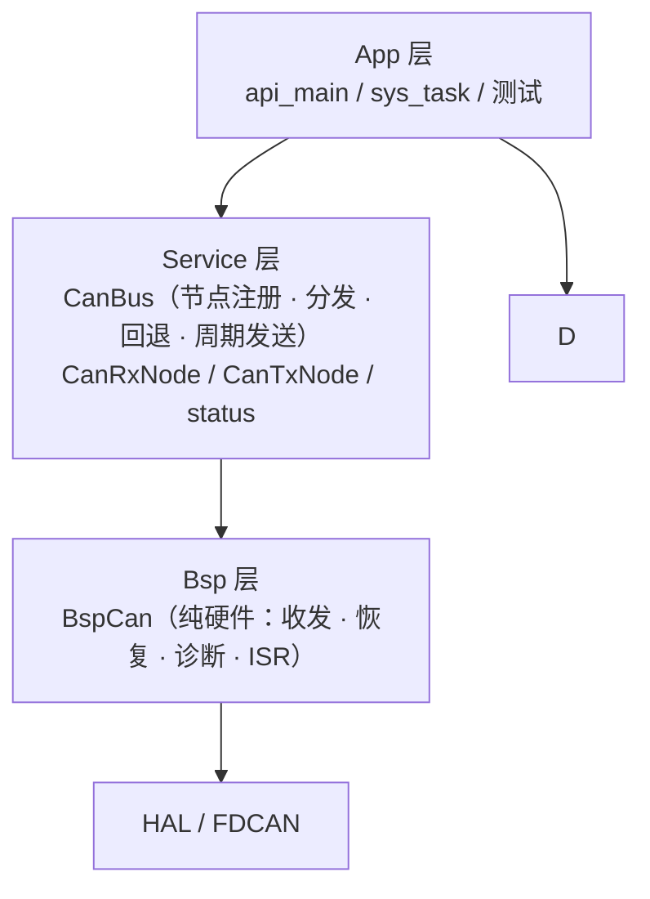

# CAN 分层合并计划（0 → 1）

> **状态：已实施完成（2026-10-01）**——编译 0 error / 0 warning，host 恢复状态机测试通过；实机回归待做，结果记入 `User/App/test/can/README.md`。
>
> 目标：把 `User/Bsp/merge/bsp_can.*`（纯硬件驱动）与工程的 CAN 总线节点系统合并，得到 **Bsp 层纯硬件 + Service 层总线（CanBus）** 的分层结构。

---

## 0. 前置事实（已核查）

- `User/CMakeLists.txt` 用 `file(GLOB_RECURSE ../User/*.cpp CONFIGURE_DEPENDS)` 收集源文件，因此 `Bsp/merge/*.cpp` **当时也在参与编译**（`bsp_init()`、`bsp_can1/2/3` 重复定义），必须删除该目录。
- `SysFlag*` / `sysEvent` 共 **11 个文件 73 处**引用。
- CMSIS-RTOS2 API 使用点：`status.*`、`bsp_can.hpp`、`can_tx_node.*`、`can_tx_task.cpp`、`dji_motor.*`。
- 注册节点的业务方：`dji_motor.cpp`（`regist(*_can_item, …)` / `unregist`）；
  `dm_motor_test.cpp` 直接使用 `bsp_can2.send/receive`。

---

## 1. 已定裁决

| # | 决议 |
|---|---|
| 1 | Bsp 层 `bsp_can.*` 以 **merge 版**为准：纯硬件，无节点、无回退缓冲，`receive()` 直读 `_rx_message_buffer` |
| 2 | `receive()` 默认超时 `portMAX_DELAY`（merge 语义）；`CanMode` 删除 |
| 3 | Bus-Off 恢复用当前的 `service_recovery()`，其内容**并入 `bsp_can.cpp`**，删除 `bsp_can_recovery.cpp`；merge 的 `bus_recover()` 舍去；`tx_recover()` 保留 |
| 4 | 诊断沿用现有 `diagnostics` 结构体（补入 merge 的计数字段），测试代码基本不用改 |
| 5 | 总线节点系统（`rx_head`/`tx_head`/`regist`/回退缓冲/分发任务）**移到 Service 层新类 `CanBus`** |
| 6 | 去掉**全部 `friend`**：需要类外访问的成员与构造函数一律设为 `public` |
| 7 | 命名规范：函数小写 + 下划线；FreeRTOS 一律用**原生 API** |
| 8 | `sysEvent` / `SysFlag*` 机制保留，但改用原生 EventGroup，并重命名为 snake_case |

---

## 2. 目标分层



- `BspCan` = merge 骨架，**不认识节点**。
- `CanBus` 持有 `BspCan*` + 节点链表 + 回退缓冲。
- 消费者不重叠：分发任务消费 `BspCan::_rx_message_buffer`；`CanBus::receive()` 读回退缓冲。

---

## 3. 命名与 API 基线

| 旧 | 新 |
|---|---|
| `sysEvent` | `sys_event`（`EventGroupHandle_t`） |
| `SysFlagInit` / `SysFlagSet` | `sys_flag_init` / `sys_flag_set` |
| `SysCompleteInit` | `sys_complete_init` |
| `SysInitError()` / `SysInitError(Status)` | `sys_init_error()` / `sys_init_error(Status)`（重载保留） |
| `SysFlagWait` / `SysFlagWaitRunning` | `sys_flag_wait` / `sys_flag_wait_running` |
| `(osEventFlagsGet(sysEvent) & SYS_FLAG_RUNNING_BIT) != 0U` | 新增 `bool sys_flag_running()` |
| `osEventFlags*` | `xEventGroupCreate/SetBits/ClearBits/GetBits/WaitBits` |
| `osWaitForever` | `portMAX_DELAY` |
| `osThreadExit()` | `vTaskDelete(NULL)` |
| `osMutexNew/Delete/Acquire/Release` | `xSemaphoreCreateMutex` / `vSemaphoreDelete` / `xSemaphoreTake` / `xSemaphoreGive` |
| `CanTxNode::filldata` | `fill_data` |

宏 `SYS_FLAG_RUNNING_BIT`（bit22）/ `SYS_FLAG_INIT_FAIL_BIT`（bit23）不变——FreeRTOS 事件组共 24 位，bit23 已是上限，安全。

---

## 4. 实施阶段

> 阶段 1 的改名会让全仓报错，**阶段 1–5 期间不要编译**，全部改完后统一编译。

### 阶段 1 — `status.*`（底层，先做）

**`User/Service/status.hpp`**

- 去掉 `cmsis_os2.h`，改 `#include "FreeRTOS.h"` + `"event_groups.h"`
- `extern EventGroupHandle_t sys_event;`
- 6 个函数改 snake_case，并新增 `bool sys_flag_running(void);`

**`User/Service/status.cpp`**

- `sys_event = xEventGroupCreate();`
- `sys_flag_set`：`xEventGroupSetBits(...1U << (uint8_t)statu);` + `xEventGroupClearBits(...1U << (uint8_t)Status::OK);`
- `sys_flag_wait`：`xEventGroupWaitBits(sys_event, 1U << (uint8_t)statu, pdFALSE, pdTRUE, timeout)`
- `sys_flag_wait_running`：`sys_event == NULL → vTaskDelete(NULL)`；
  `xEventGroupWaitBits(..., pdFALSE, pdTRUE, portMAX_DELAY)` 之后 `if (!sys_flag_running()) vTaskDelete(NULL);`
- `sys_flag_running()`：`sys_event != NULL && (xEventGroupGetBits(sys_event) & SYS_FLAG_RUNNING_BIT) != 0U`

**调用点批量替换**：`api_main.cpp`、`can_rx_node.cpp`、`can_tx_node.cpp`、`dji_motor.cpp`、
`can_recovery_test.cpp`、`dji_motor_test.cpp`。

### 阶段 2 — `Bsp/bsp_can.*` 重写（merge 骨架 + 你的恢复）

**`bsp_can.hpp`**

- 类骨架取 merge；**保留** `Config{FDCAN_HandleTypeDef*, const char*}`（删 `mode`）
- 删 `CanMode`、`CanRxNode/CanTxNode` 前置声明、`rx_head`/`tx_head`/`_rx_return_buffer`、
  **全部 `friend`**、`cmsis_os2.h`
- public：`Config`、`_hfdcan`、`_tx_message_buffer`、`_rx_message_buffer`、`diagnostics`
- 接口：
  `init` / `send` / `receive(…, timeout_ms = portMAX_DELAY)` / `tx_recover` / `service_recovery` /
  `process_fifo0_isr(its, woken)` / `trigger_tx_from_isr(woken)` / `process_error_isr(its)`
- private：
  `_reset_hardware` / `_configure_hardware` / `_rollback_init` / `_set_tx_empty_it` / `_update_tx_empty_it` /
  `_start_transmission` / `_fill_tx_header` / `_cleanup_resources` / `_tx_available`
- **删除** `trigger_tx()`（任务侧不再需要）

`diagnostics` 结构体（保留旧字段名 + 补 merge 计数）：

```cpp
struct Diagnostics
{
  volatile uint32_t bus_off_events;      // 旧，保留
  volatile uint32_t recovery_attempts;   // 旧，保留
  volatile uint32_t recovery_successes;  // 旧，保留
  volatile uint32_t recovery_max_ticks;  // 旧，保留
  volatile bool     recovering;          // 旧，保留
  volatile uint32_t tx_dropped;          // 旧，保留（写硬件 FIFO 失败）
  volatile uint32_t rx_dropped;          // 旧，保留（软件缓冲满）
  volatile uint32_t tx_stall_recover;    // 新（merge stall_recover_cnt）
  volatile uint32_t tx_it_fail;          // 新（merge it_fail_cnt）
  volatile uint32_t rx_lost;             // 新（硬件 FIFO 溢出）
  volatile uint32_t rx_len_drop;         // 新（DLC > 8）
  volatile uint32_t err_passive;         // 新
  volatile uint32_t err_warning;         // 新
} diagnostics;
```

**`bsp_can.cpp`**

- 三段中断回调（merge 版）：RX 带 `its`、TX-Empty、`HAL_FDCAN_ErrorStatusCallback`；RX 回调内不 yield
- `send()`：保留 11 位校验 + `BAD_ARG` / `NOT_INIT` / `FULL`，并**保留 `BUSY`**
  （`!_tx_available()` 时返回，`can_recovery_test` 依赖）；内部走 `_start_transmission()`
- `receive()`：直读 `_rx_message_buffer`（merge 语义）
- `process_fifo0_isr`：循环 drain（上限 `Init.RxFifo0ElmtsNbr`）+ 64 B raw 缓冲 + `DLC > 8` 丢弃计数
- TX：`_tx_lock` + `start_transmission(wait)` + `_set_tx_empty_it` / `_update_tx_empty_it` 按需开关
- RX ISR 内 `_rx_sw_drop_cnt` → `diagnostics.rx_dropped` 等全部映射
- **`bsp_can_recovery.cpp` 的 `_tx_available()` + `service_recovery()` 原样搬进本文件**，
  `++diagnostics.*` 保持同名
- `init()` 可重入：`_reset_hardware → _cleanup_resources → 建资源 → _configure_hardware`，失败 `_rollback_init`
- 析构：`_reset_hardware + _cleanup_resources`

**`Bsp/bsp_can_recovery.cpp` → 删除。**

### 阶段 3 — Service 层

**新增 `User/Service/can_bus.hpp` / `can_bus.cpp`**

```cpp
class CanBus
{
public:
  CanBus(BspCan *can) : _can(can) {}

  Status init();                                          // 建回退缓冲
  Status send(uint32_t std_id, const uint8_t *data);       // 转发 BspCan::send
  Status receive(CanRxMsg *msg, uint32_t timeout_ms = 0);  // 读回退缓冲（现在的语义）

  void rx_poll();   // 一轮分发（每条总线 ≤ 8 帧）
  void tx_poll();   // 一轮发送扫描（1 ms）

  BspCan    *_can;
  CanRxNode *rx_head;
  CanTxNode *tx_head;
  MessageBufferHandle_t _rx_return_buffer;

  static CanBus *const buses[3];
  static bool frozen;   // 统一冻结标志（替代 CanRxNode::frozen / CanTxNode::frozen）
};

extern CanBus bus_can1, bus_can2, bus_can3;
extern "C" void can_rx_task(void *argument);   // 定义在 can_bus.cpp
extern "C" void can_tx_task(void *argument);
```

- `can_rx_task`：`sys_flag_wait_running()` → `CanBus::frozen = true` → 1 ms 循环调 `bus->rx_poll()`；
  未命中帧写入 `_rx_return_buffer`，满则 `sys_flag_set(Status::FULL)`
- `can_tx_task`：`sys_flag_wait_running()` → 冻结 → 无节点则 `vTaskDelete(NULL)` →
  1 ms 遍历 `tx_head`，`xSemaphoreTake(node->bufferMutex, pdMS_TO_TICKS(1))`；
  `can->send(...)` 改 `bus->send(...)`

**`Service/can_rx_node.hpp` / `.cpp`**

- `regist(CanBus &bus, …)` / `unregist(CanBus &bus, CanRxNode *node)`
- 成员 `_can_id` / `_id_type` / `_callback` / `_context` / `next` / `node_num` → public，
  构造函数 public，**删 3 条 friend**、`is_frozen()`、`frozen`（并入 `CanBus::frozen`）

**`Service/can_tx_node.hpp` / `.cpp`**

- `init(CanBus &bus)`；`regist(CanBus &, …)` / `unregist`
- 成员 `txBuffer` / `division` / `bufferRegister` / `bufferUnsend` / `bufferMutex` / `next` /
  `last_send_tick` / `node_num` → public，构造函数 public，**删 4 条 friend**、`frozen`
- `bufferMutex` 改为 `SemaphoreHandle_t`；删 `bufferMutex_Attr` / `mutexName`（原生不需要名字）
- `osMutexAcquire(..., osWaitForever)` → `xSemaphoreTake(..., portMAX_DELAY)`；
  `filldata` → `fill_data`

### 阶段 4 — App / Device 适配

| 文件 | 改动 |
|---|---|
| `App/task/can_rx_task.cpp` / `can_tx_task.cpp` | **删除**（逻辑进 `can_bus.cpp`） |
| `App/app_task.hpp` | 删除 `can_rx_task` 声明（移到 `can_bus.hpp`） |
| `App/api_main.cpp` | `#include "can_tx_node.hpp"` → `"can_bus.hpp"`；任务创建行不变；`SysFlagInit` / `SysCompleteInit` 改名 |
| `App/task/sys_task.cpp` | 每路 `tx_recover(); service_recovery();` |
| `Device/dji_motor.hpp` | `BspCan *_can_item` → `CanBus *_can_item`；`#include "can_bus.hpp"`；`osMutexId_t` / `osMutexAttr_t` → `SemaphoreHandle_t`；注释更新 |
| `Device/dji_motor.cpp` | 构造参数 `BspCan&` → `CanBus&`；`regist(*_can_item, …)`；`osMutex*` → `xSemaphore*`；`sys_init_error` / `sys_flag_running` 改名 |
| `App/test/motor/dm_motor_test.cpp` | `bsp_can2.send/receive` → `bus_can2.send/receive`（**必须改**，否则与分发任务争抢同一缓冲） |

### 阶段 5 — 测试 / 文档 / 清理

- `App/test/can/can_recovery_test.cpp`：`SysFlagWaitRunning` 改名；`diagnostics` 字段同名 → 其余不动
- `App/test/can/test_recovery_host.py`：按新类布局更新（`Config`、`_hfdcan`、`_rx_message_buffer`、`service_recovery`）
- `App/test/can/README.md`、`Device/dji_motor.hpp` 注释：改为 CanBus 分层描述
- `Bsp/bsp_cfg.cpp` / `.hpp`：仅注释（构造语句 `{&hfdcan1, "CAN1"}` 不变）
- **删除 `User/Bsp/merge/`**
- `docs/编码规范.md`：命名、friend、分区横幅相关条款已同步

### 阶段 6 — 验证

- `Configure`（Debug preset）→ `Build`，期望 0 error、尽量 0 warning；`CONFIGURE_DEPENDS` 会自动收集新增/删除的源文件。

回归清单：

1. 三路 CAN 正常收发
2. 命中节点 → 回调消费（`DjiMotor` 反馈解包、`Online` 刷新）
3. 未命中 → `CanBus::receive()` 取到
4. 突发 256 帧 → 触发 `Status::FULL`，`diagnostics.tx_dropped` 计数
5. 断连 → Bus-Off → `service_recovery()` 自动恢复，`bus_off_events` / `recovery_successes` 增长
6. `sys_task` 10 ms 周期不阻塞（`sys_task_loop_count` 持续推进）
7. Live Watch 可读 `diagnostics` 全字段
8. `can_tx_task` 无节点时正常退出
9. `dji_motor` 析构运行期 `unregist` 返回 `NOT_SUPPORTED` 的路径不变

---

## 5. 顺序约束与风险

| 风险 | 处理 |
|---|---|
| 改名期全仓报错 | 阶段 1–5 一次做完再编译，不做增量编译 |
| `BspCan::receive()` 与分发任务双读者 | 约定 App 只用 `CanBus::receive()`；`BspCan::receive()` 文档标注「仅未启用分发时使用」 |
| FreeRTOS 事件组只有 24 位 | `SYS_FLAG_*` 保持 bit22 / bit23，不新增高位 |
| `merge/` 重复符号 | 阶段 5 必须删目录，否则编译失败 |
| `CanTxNode` 无 `mutexName` | 原生信号量无名，调试时用 `uxSemaphoreGetCount` 观察 |
