# CAN 总线改造实施计划

> 状态：**设计已确认（2026-10-04），待实施**。本文只写要做什么与怎么做，不讨论备选方案。
> 方案论证过程见 [CAN 总线模型改造论证](CAN总线模型改造论证.md)。
> 未实机验证：本文所有"实机判据"须由开发者在硬件上执行，本次会话禁止烧录
>  
---

## 0. 决策记录（2026-10-04 已确认）

| # | 决策 | 内容 |
| --- | --- | --- |
| 1 | 设备与驱动的关系 | **设备即驱动**：一个类同时描述身份与行为；不拆 device / driver，不做 match |
| 2 | 调度归属 | **总线负责收发全部调度**：接收分发、发送调度、事务超时推进均在 `CanBus` |
| 3 | 实施方式 | **分三步** |
| 4 | 帧与事务的关系 | 事务只结束等待状态，**不消耗帧**；帧照常交给设备解析（否则应答里的数据会丢） |
| 5 | 设备的帧数量 | **一个设备可持有多条帧**（主控通讯必须命令帧 + ACK 帧各一条） |
| 6 | 新增状态码 | **第一步不加**；第二步引入延迟探测时再加 `Status::RETRY` |
| 7 | 发送意图 | 新增**"一次发送 + 一直接收"**模式（`ONESHOT_LATCH`），与可反复触发的 `ONESHOT` 区分 |
| 8 | `sys_task` | 改为调用总线封装的恢复接口（`_can` 收为私有后不再直接访问） |
| 9 | 设备节拍 | 总线在发送轮询里给每个已启动设备一次可选回调，供设备做超时保护等周期性动作 |
| 10 | 离线阈值 | **只有一个阈值（默认 50 ms）**；超过即判离线 |
| 11 | 离线的反应 | 由设备自选：**强制归零**（执行器）或**只置离线标志供业务查询**（只读设备）；`fill_data()` 在离线时返回 `TIMEOUT` |
| 12 | 共帧与槽位 | **总线层不再处理凑帧**：帧是单写者的整体 8 字节；一条帧带多个电机的情形由**电机组**设备承担（电机组挂总线，成员电机挂电机组） |
| 13 | 电机组形态 | 发送与接收**各有**"共享帧 / 每成员独立帧"两种布局，四种组合都要能表达（见 §3.1） |
| 14 | 组的存在条件 | 只有当发送或接收**至少一侧是共享帧**时才需要组；两侧都是 1 对 1 时每个电机直接挂总线 |
| 15 | 在线判定 | **统一复用已有的 `Online` 对象**（构造即注册到静态链表，sys_task 每 10 ms 跑 `Online::update()`）；总线不维护时间戳、不提供在线查询接口 |
| 16 | 任务划分 | **`can_rx_task` 与 `can_tx_task` 保持独立**，不合并 |
| 17 | 第一步的范围 | **不做 `probe` / 延迟探测**（当前无真实用户），移到接入传感器时再做；第一步不新增状态码、不加设备启动状态 |
| 18 | 设备接口面 | 只保留 **2 个虚函数**：`on_can_rx` 与 `on_poll_tick`；**不设** `probe()` / `remove()`，清理动作直接写在设备析构里 |
| 19 | 冻结判据 | **删掉 `CanBus::frozen`**，统一用 `sys_flag_running()`（据见 §1.8） |
| 20 | 电机组范围 | **先只实现组合 A**（共享发送 + 每成员独立接收）；组合 B/C/D 等有真实协议再补 |
| 21 | 帧的归属 | **帧表归总线**（不把帧内嵌进设备）：发送路径保持"总线里唯一一条"，便于将来加发送统计与优先级 |
| 22 | 回退缓冲 | **删除 `_rx_return_buffer` 与 `CanBus::receive()`**；未被任何设备认领的帧只计诊断计数后丢弃 |

---

## 1. 目标形态

### 1.1 分层与职责

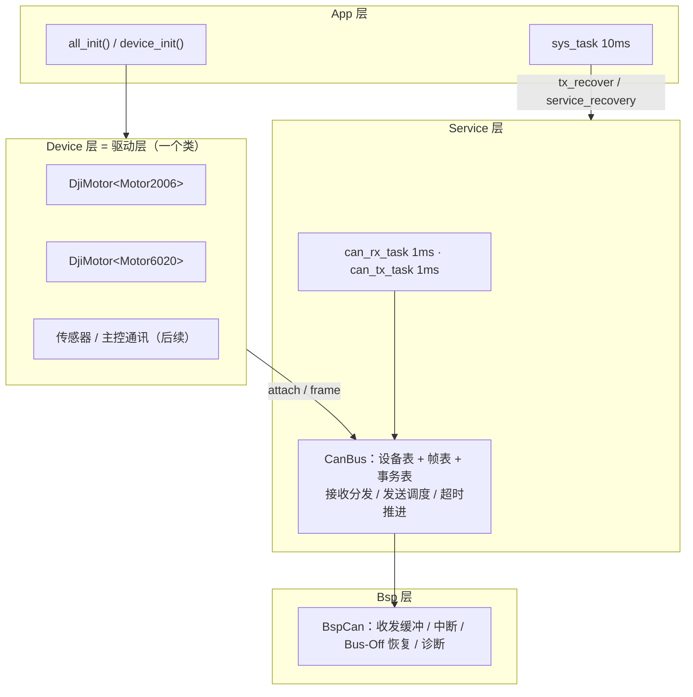
```mermaid
flowchart TB
  subgraph APP["App 层"]
    AI["all_init() / device_init()"]
    ST["sys_task 10ms"]
  end

  subgraph DEV["Device 层 = 驱动层（一个类）"]
    M1["DjiMotor&lt;Motor2006&gt;"]
    M2["DjiMotor&lt;Motor6020&gt;"]
    SN["传感器 / 主控通讯（后续）"]
  end

  subgraph SVC["Service 层"]
    CB["CanBus：设备表 + 帧表 + 事务表<br/>接收分发 / 发送调度 / 超时推进"]
    RT["can_rx_task 1ms · can_tx_task 1ms"]
  end

  subgraph BSP["Bsp 层"]
    BC["BspCan：收发缓冲 / 中断 / Bus-Off 恢复 / 诊断"]
  end

  AI --> DEV
  DEV -->|attach / frame| CB
  ST -->|tx_recover / service_recovery| SVC
  RT --> CB
  CB --> BC
```

总线核心**只做两件事**：把收到的帧交给正确的设备、决定哪条帧什么时候发出去。它不认识任何协议字段。

### 1.2 四个核心概念

| 概念 | 是谁 | 数量 | 归属 |
| --- | --- | --- | --- |
| **设备** | 一个类，同时描述"我是谁"和"我怎么收" | 当前 2 个 | 设备数组（编译期实例） |
| **帧** | 一条 8 字节报文 + 发送意图 + 周期（**单写者**） | 当前 2 条 | 总线帧表，设备持指针 |
| **事务** | 一次"发出后需要确认"的投递 | 当前 0 个 | 总线事务表（第三步） |
| **总线** | 一条 CAN，持有上面三张表与调度节拍 | 3 条 | `CanBus` 全局实例 |

### 1.3 生命周期（设备）

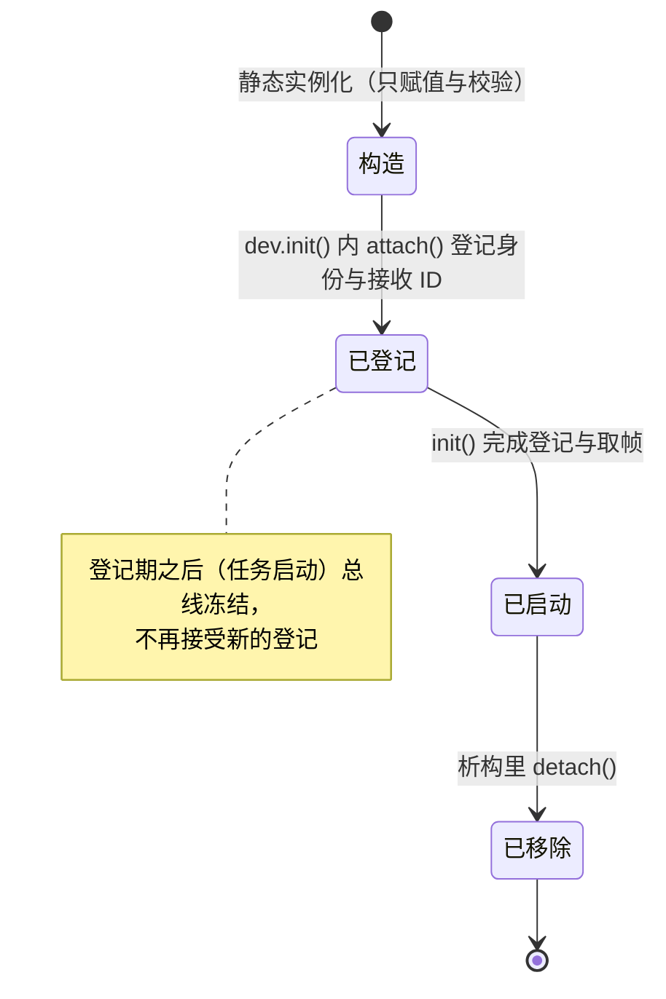
```mermaid
stateDiagram-v2
  [*] --> 构造: 静态实例化（只赋值与校验）
  构造 --> 已登记: dev.init() 内 attach() 登记身份与接收 ID
  已登记 --> 已启动: init() 完成登记与取帧
  已启动 --> 已移除: 析构里 detach()
  已移除 --> [*]

  note right of 已登记
    登记期之后（任务启动）总线冻结，
    不再接受新的登记
  end note
```

### 1.4 数据流：接收

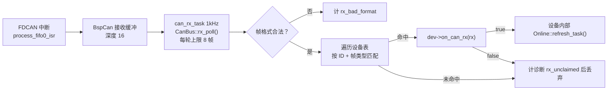
```mermaid
flowchart LR
  ISR["FDCAN 中断<br/>process_fifo0_isr"] --> RB["BspCan 接收缓冲<br/>深度 16"]
  RB --> RX["can_rx_task 1kHz<br/>CanBus::rx_poll()<br/>每轮上限 8 帧"]
  RX --> FMT{"帧格式合法？"}
  FMT -->|否| DROP["计 rx_bad_format"]
  FMT -->|是| SCAN["遍历设备表<br/>按 ID + 帧类型匹配"]
  SCAN -->|命中| CB["dev->on_can_rx(rx)"]
  CB -->|true| MARK["设备内部 Online::refresh_task()"]
  CB -->|false| RET
  SCAN -->|未命中| RET["计诊断 rx_unclaimed 后丢弃"]
```

### 1.5 数据流：发送

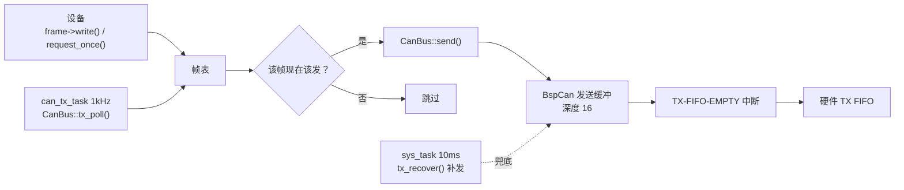
```mermaid
flowchart LR
  DEV["设备<br/>frame->write() / request_once()"] --> FT["帧表"]
  TX["can_tx_task 1kHz<br/>CanBus::tx_poll()"] --> FT
  FT --> JUDGE{"该帧现在该发？"}
  JUDGE -->|是| SEND["CanBus::send()"]
  JUDGE -->|否| SKIP["跳过"]
  SEND --> TB["BspCan 发送缓冲<br/>深度 16"]
  TB --> ISR2["TX-FIFO-EMPTY 中断"] --> HW["硬件 TX FIFO"]
  ST["sys_task 10ms<br/>tx_recover() 补发"] -.兜底.-> TB
```

### 1.6 设备侧处理总图

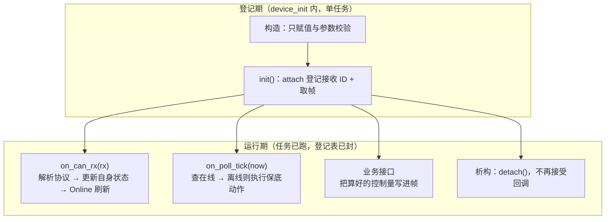
```mermaid
flowchart TB
  subgraph S1["登记期（device_init 内，单任务）"]
    A1["构造：只赋值与参数校验"] --> A2["init()：attach 登记接收 ID + 取帧"]
  end
  subgraph S2["运行期（任务已跑，登记表已封）"]
    B1["on_can_rx(rx)<br/>解析协议 → 更新自身状态 → Online 刷新"]
    B2["on_poll_tick(now)<br/>查在线 → 离线则执行保底动作"]
    B3["业务接口<br/>把算好的控制量写进帧"]
    B4["析构：detach()，不再接受回调"]
  end
  A2 --> B1
  A2 --> B2
  A2 --> B3
  A2 --> B4
```

### 1.7 总线侧处理总图

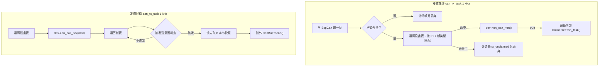
```mermaid
flowchart TB
  subgraph RX["接收轮询 can_rx_task 1 kHz"]
    R1["从 BspCan 取一帧"] --> R2{"格式合法？"}
    R2 -->|否| R3["计坏帧并丢弃"]
    R2 -->|是| R4["遍历设备表：按 ID + 帧类型匹配"]
    R4 -->|命中| R5["dev->on_can_rx(rx)"]
    R5 -->|true| R6["设备内部 Online::refresh_task()"]
    R4 -->|未命中| R7["计诊断 rx_unclaimed 后丢弃"]
  end
  subgraph TX["发送轮询 can_tx_task 1 kHz"]
    T1["遍历设备表"] --> T2["dev->on_poll_tick(now)"]
    T2 --> T3["遍历帧表"]
    T3 --> T4{"按发送意图判定"}
    T4 -->|该发| T5["锁内取 8 字节快照"]
    T5 --> T6["锁外 CanBus::send()"]
    T4 -->|不该发| T3
  end
```

> **在线判定不在总线侧**：设备内嵌已有的 `Online` 对象（`Service/online_check.*`），
> 收到有效帧时调 `refresh_task()`；离线判定由 sys_task 每 10 ms 的 `Online::update()`
> 统一推进，业务用 `is_online()` 查询。总线既不维护时间戳，也不提供在线查询接口。
> 电机组逐成员判在线就是"每个成员各持一个 `Online`"。

### 1.8 冻结判据：为什么删得掉 `frozen`

现有 `CanBus::frozen` 与 `sys_flag_running()` 判的是同一件事，而且 **`frozen` 反应更慢**：

| 时刻 | `sys_flag_running()` | `CanBus::frozen` |
| --- | --- | --- |
| `sys_complete_init()` 置运行位 | 立即为真 | 仍为假 |
| 任务被唤醒、执行 `wait_running()` 后才置 `frozen` | 真 | 才为真 |

也就是在"运行位已置、任务刚被唤醒"这段窗口里，`frozen` 还没生效 —— **它不但冗余，保护还更弱**。删掉它，登记判据统一为 `sys_flag_running()`。

**顺带说明 `status` 这套系统标志是怎么实现的**（新代码应复用，不要再自造静态 bool）：

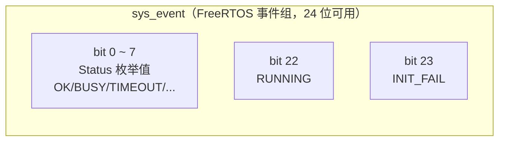
```mermaid
flowchart LR
  subgraph EG["sys_event（FreeRTOS 事件组，24 位可用）"]
    B0["bit 0 ~ 7<br/>Status 枚举值<br/>OK/BUSY/TIMEOUT/..."]
    B22["bit 22<br/>RUNNING"]
    B23["bit 23<br/>INIT_FAIL"]
  end
```

| 机制 | 做法 |
| --- | --- |
| 位号复用 | `Status` 的枚举值**直接当位号**（`1U << (uint8_t)statu`），0 ~ 7 位恰好容纳 8 个状态码 |
| 高位专用 | 运行位与失败位放 22 / 23，与状态码位不重叠 |
| 初始化 | `sys_flag_init()` 建事件组并置 OK 位；必须先于任何登记与任务创建 |
| 失败粘滞 | `sys_init_error()` 置失败位并清运行位；此后 `sys_complete_init()` 不会再置运行位（它先判失败位） |
| 任务等待 | 任务入口 `sys_flag_wait_running()` 阻塞等运行位；事件组缺失或仍未运行就 `vTaskDelete(NULL)` |
| 运行判据 | `sys_flag_running()` 读运行位，供各处的"只允许初始化期"判断 |

> 结论：系统级"阶段位"已经有了，**新代码不需要再引入新的阶段标志**；
> 真要表达新阶段，应该新增一个位，而不是新加一个静态 bool。

---

## 2. 核心对象

### 2.1 `CanDevice`（设备接口）

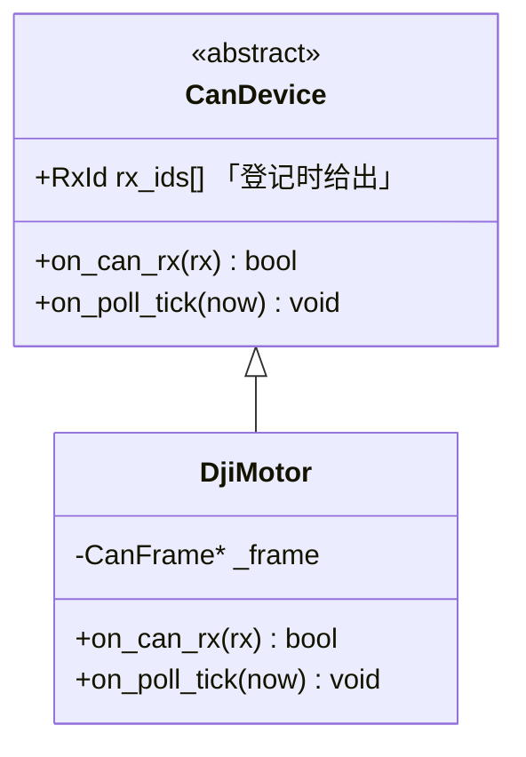
```mermaid
classDiagram
  class CanDevice {
    <<abstract>>
    +RxId rx_ids[]  「登记时给出」
    +on_can_rx(rx) bool
    +on_poll_tick(now) void
  }
  class DjiMotor {
    -CanFrame* _frame
    +on_can_rx(rx) bool
    +on_poll_tick(now) void
  }
  CanDevice <|-- DjiMotor
```

**只有两个纯虚函数**，其余一概不要：

| 动作 | 含义 |
| --- | --- |
| `on_can_rx(rx)` | 收到关心的帧时由分发任务**同步**调用，必须短、不阻塞 |
| `on_poll_tick(now)` | 由发送任务每个 1 ms 节拍调用一次，用于查在线、执行保底动作 |

> 没有 `probe()`：第一步不做启动阶段与延迟探测（决策 17）。
> 没有 `remove()`：清理动作直接写在设备析构里（决策 18），少一个阶段、少一条回调链。

### 2.2 `CanFrame`（帧）

| 字段 | 含义 |
| --- | --- |
| `can_id` | 帧 ID（11 位标准帧） |
| `data[8]` | 帧内容（**单写者**：只有归属它的设备写） |
| `demand` | 发送意图（见下表） |
| `period_ms` | 周期（`PERIODIC` 用） |
| `last_send_tick` | 上次发出时刻（总线维护） |
| `mutex` | 一把锁：写方与发送任务的快照相互排斥 |

**发送意图四态**：

| 取值 | 语义 | 可重复触发 | 用在哪 |
| --- | --- | --- | --- |
| `IDLE` | 不主动发 | — | 只收不发 |
| `ONESHOT` | 设备请求后发一次 | **是**，每次请求发一次 | 按需查询、主控命令 |
| `ONESHOT_LATCH` | 整个运行期**只发一次**，发出后自动转为 `IDLE` 且不再接受请求 | 否 | 开机配置帧：传感器 C 配置一次后转为持续上报 |
| `PERIODIC` | 到周期就发 | 自动 | 电机控制帧、周期查询、电机组共帧 |

> **帧是单写者的整体 8 字节**：总线不认识"槽位"，也不做"凑帧"。
> 一条帧装多个电机的情形由**电机组**设备自己处理（见 §3）。
> 发送时在锁内取一份 8 字节快照，在锁外调 `send()`，临界区只做 `memcpy`。

> `ONESHOT` 与 `ONESHOT_LATCH` 的区别不在"发几次"，而在**能不能被再次触发**。
> 某些模块重复接收配置帧会产生副作用（重新初始化、反复擦写闪存），
> 所以把"只发一次"做成帧的固有属性，而不是依赖调用方记得不要重复请求。

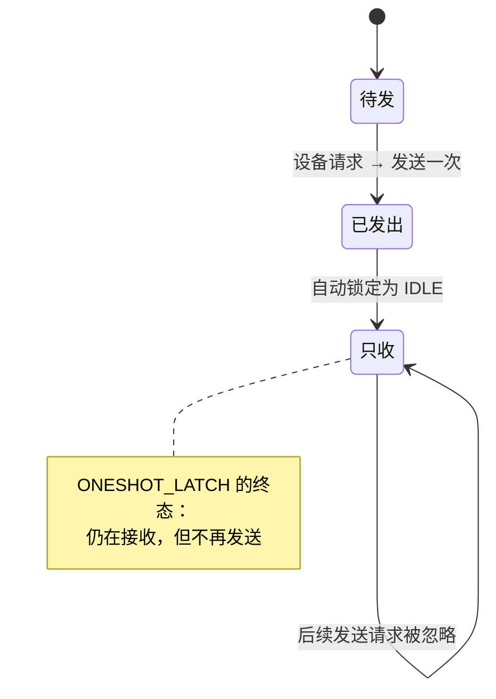
```mermaid
stateDiagram-v2
  [*] --> 待发
  待发 --> 已发出: 设备请求 → 发送一次
  已发出 --> 只收: 自动锁定为 IDLE
  只收 --> 只收: 后续发送请求被忽略
  note right of 只收
    ONESHOT_LATCH 的终态：
    仍在接收，但不再发送
  end note
```

### 2.3 `CanBus`

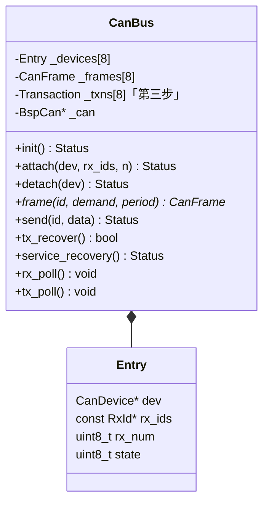
```mermaid
classDiagram
  class CanBus {
    -Entry _devices[8]
    -CanFrame _frames[8]
    -Transaction _txns[8]「第三步」
    -BspCan* _can
    +init() Status
    +attach(dev, rx_ids, n) Status
    +detach(dev) Status
    +frame(id, demand, period) CanFrame*
    +send(id, data) Status
    +tx_recover() bool
    +service_recovery() Status
    +rx_poll() void
    +tx_poll() void
  }
  class Entry {
    CanDevice* dev
    const RxId* rx_ids
    uint8_t rx_num
    uint8_t state
  }
  CanBus *-- Entry
```

**总线新增对外能力（供 `sys_task` 使用）**：`tx_recover()` 与 `service_recovery()`。现在 `sys_task` 是直接读 `bus._can` 再调 BspCan，改造后由总线转发，`_can` 收为私有。

### 2.4 表容量与内存

| 表 | 每总线容量 | 单项估算 | 小计 |
| --- | --- | --- | --- |
| 设备表 | 8 | 约 13 B | 约 104 B |
| 帧表 | 8 | 约 24 B | 约 192 B |
| 事务表（第三步） | 8 | 约 20 B | 约 160 B |

全部为静态数组，无动态分配。三张表合计 **< 500 B**，相对当前 DTCMRAM 占用（65120 B / 49.68%）可忽略。

### 2.5 离线保护（设备自保护）

**只有一个阈值，默认 50 ms**，由设备内嵌的 `Online` 对象承担（构造时给定 `timeout_gap`，例如 `Online(50)`）。

> **阈值精度不受推进周期影响**：`Online` 的判据是 tick 差值，sys_task 的 10 ms 只决定
> "发现离线"的延迟上限（最坏 60 ms 看到），阈值本身仍是 50 ms。

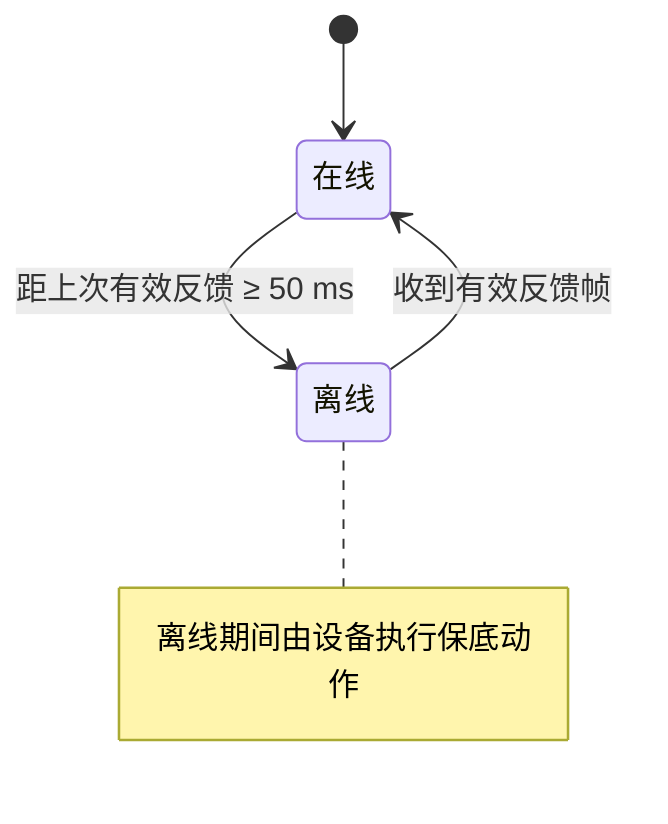
```mermaid
stateDiagram-v2
  [*] --> 在线
  在线 --> 离线: 距上次有效反馈 ≥ 50 ms
  离线 --> 在线: 收到有效反馈帧
  note right of 离线
    离线期间由设备执行保底动作
  end note
```

**离线后的反应由设备自选**（阈值统一，策略不一）：

| 反应 | 适用 | 具体行为 |
| --- | --- | --- |
| 强制归零 | 执行器（电机） | 每拍把控制帧内容写为归零值，覆盖业务写入；`fill_data()` 返回 `TIMEOUT` |
| 只给标志 | 只读设备（传感器） | 只置离线标志，业务自行查询与降级 |

**关键判断：归零不需要新的发送模式。** 归零不是"额外发一条指令"，
而是**把该帧的数据源从业务值切到保底值**；控制帧本来就在周期发送，只是内容被覆盖。

**为什么必须由总线提供节拍**：业务任务可能在整个离线期间都不再调用 `fill_data()`
（例如它先查状态、发现离线就跳过），那样永远不会触发归零。
所以总线在发送轮询里给每个已启动设备一次可选回调：

| 接口 | 说明 |
| --- | --- |
| `CanDevice::on_poll_tick(now)` | 默认空实现；设备在此查在线、必要时写归零 |
| `Online::is_online()` | 设备内嵌对象；**已有实现，不在本次改动范围** |
| `Online::update()` | sys_task 每 10 ms 已调用，是全部设备的离线判定推进点 |
| `Online::refresh_task()` | 设备在 `on_can_rx` 里收到有效帧时调用 |

**保底动作由设备定义**：不一定是"写零"（也可能是切阻尼、断使能），
所以总线只提供节拍与发送能力，**在线判定复用已有的 `Online`**，不提供"归零"这个语义。

**落在第一步**：与设备节拍钩子一起实现。它属于安全功能，第一版电机就该带上。

---

## 3. 各类设备：从总线拿什么、给总线什么

| 设备类型 | 总线交给它什么 | 它怎么处理 | 它交给总线什么 | 何时给 |
| --- | --- | --- | --- | --- |
| 电机（DJI，单机一帧） | 反馈帧：角度 / 转速 / 转矩电流 / 温度 | 跨零展开 → 换算输出轴角度；刷新在线 | 控制帧 2 字节（原始电流或电压指令） | 业务每拍写；帧按周期发 |
| 电机（达妙 / 海泰，命令+反馈） | 反馈帧：位置 / 速度 / 力矩 / 温度 / 状态 | MIT 解码 → 更新状态；每条命令都有一条反馈 | 控制帧 8 字节（MIT 编码） | 同上 |
| **电机组（见 §3.1）** | 按接收布局：共享帧（切分）或每成员独立帧 | 按 ID 或偏移找到成员 → 转交解析 | 按发送布局：共享帧 8 字节 或 每成员独立帧 | 成员写各自位置；组按周期发 |
| 传感器 A（一直回，不发） | 数据帧 | 解析 → 更新最新值；刷新在线 | 无 | — |
| 传感器 B（问一次回一次） | 应答帧 | 解析 → 更新值；同时结束事务等待 | 查询帧 | 周期 或 业务触发 |
| 传感器 C（查一次一直回） | 配置应答 + 之后的数据帧 | 配置应答校验通过后转为持续解析 | 配置帧（**只发一次**） | 启动阶段（**第二步**，需 `probe`） |
| 主控通讯（双向 + ACK） | 对方数据帧 + 我方 ACK 帧 | 按帧内容区分：数据 → 业务；确认帧 → 校验后结束事务 | 命令帧（等 ACK）+ ACK 帧（回对方） | 业务触发 / 收到对方数据时 |

> **电机组**：挂总线的是组，成员电机挂在组上，**成员不直接接触总线**。
> 因此**总线层完全不感知"凑帧"**，只看到一条普通的 `PERIODIC` 帧。四种收发组合见 §3.1。
>
> **一设备多帧**：主控通讯在等待 ACK 的同时还要回 ACK，不能共用一条帧。

### 3.1 电机组：四种收发组合

"共享帧"指一条帧承载多个成员，"每成员独立帧"指每个成员一条帧。两个维度正交，共四种组合：

| 组合 | 发送 | 接收 | 现实例 | 需要组吗 |
| --- | --- | --- | --- | --- |
| A | 共享（1 帧 N 机） | 每成员独立（N 帧） | DJI M3508 / M2006 / GM6020、LK | **需要** |
| B | 每成员独立 | 每成员独立 | 达妙、海泰 | 不需要 |
| C | 共享 | 共享（1 帧含 N 机数据） | **未找到实例**，预留支持 | **需要** |
| D | 每成员独立 | 共享 | **未找到实例**，预留支持 | **需要** |

> **判据**：只有当发送或接收**至少一侧是共享帧**时才需要组；两侧都是 1 对 1 时，
> 每个电机自己就是设备，直接挂总线，不需要多一层聚合。
> 组合 A 的两个实例分别来自参考实现的 `MotorSenderGrouping()` 与 `LKMotorInit()`；
> 组合 C / D 在本工程与参考实现中均未找到实例，属预留能力。
>
> **本步只实现组合 A**：发送共享、接收每成员独立。组合 B 根本不需要组；
> 组合 C / D 需要的"一帧切给多成员"路径**不写**，等真有这种协议再补。

**先只实现组合 A，所以不需要布局开关**：发送固定为共享（组持 1 条 `PERIODIC` 帧，
成员按 `索引 × 每成员字节数` 写入），接收固定为每成员独立（组登记 N 个接收 ID，
按 ID 算出成员索引后整帧转交）。

**成员从不需要知道细节**：只暴露两个动作，由组负责路由。

| 成员动作 | 组做什么 |
| --- | --- |
| `组->write(索引, 数据, 长度)` | 写入共帧的 `索引 × 每成员字节数` 处 |
| 组收到帧后 | 按 `接收 ID - 基址` 算出成员索引，整帧转交给该成员 |

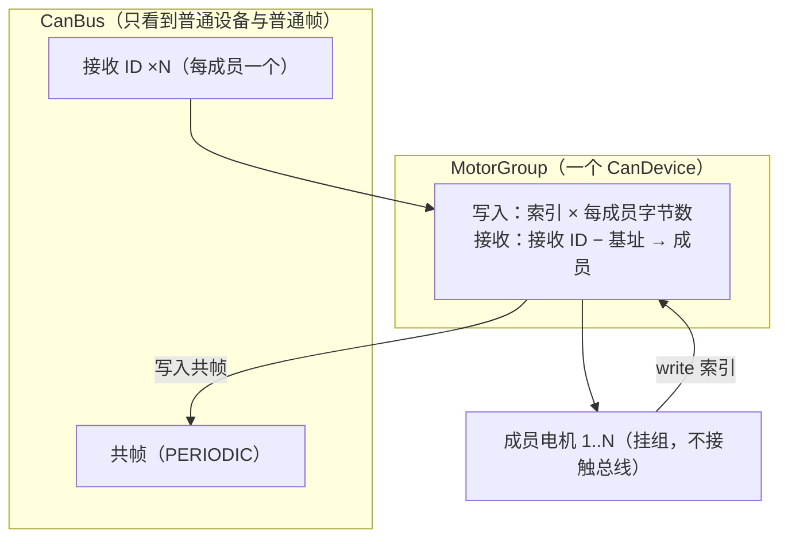
```mermaid
flowchart TB
  subgraph BUS["CanBus（只看到普通设备与普通帧）"]
    F1["共帧（PERIODIC）"]
    ID2["接收 ID ×N（每成员一个）"]
  end
  subgraph G["MotorGroup（一个 CanDevice）"]
    ROUTE["写入：索引 × 每成员字节数<br/>接收：接收 ID − 基址 → 成员"]
  end
  M["成员电机 1..N（挂组，不接触总线）"]
  M -->|write 索引| ROUTE
  ROUTE -->|写入共帧| F1
  ID2 --> ROUTE
  ROUTE --> M
```

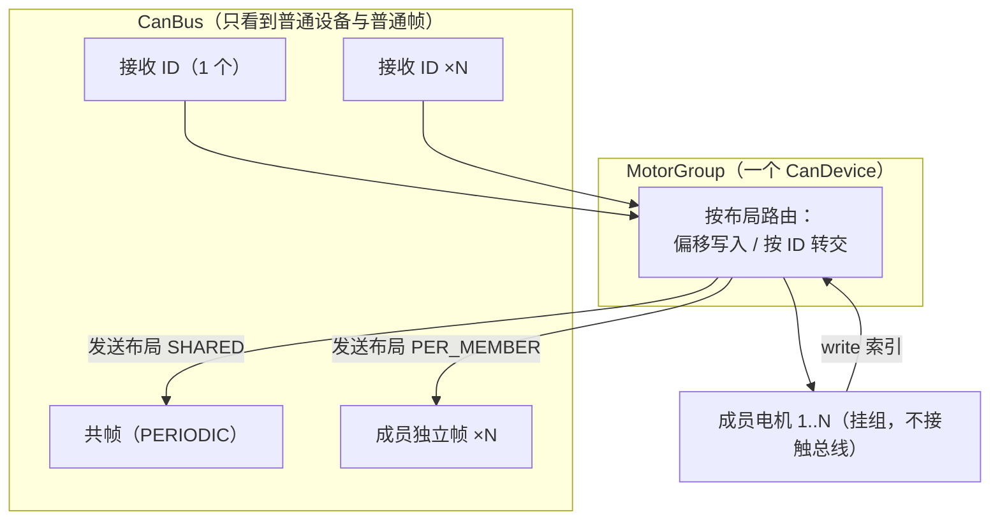
```mermaid
flowchart TB
  subgraph BUS["CanBus（只看到普通设备与普通帧）"]
    F1["共帧（PERIODIC）"]
    F2["成员独立帧 ×N"]
    ID1["接收 ID（1 个）"]
    ID2["接收 ID ×N"]
  end
  subgraph G["MotorGroup（一个 CanDevice）"]
    ROUTE["按布局路由：<br/>偏移写入 / 按 ID 转交"]
  end
  M["成员电机 1..N（挂组，不接触总线）"]
  M -->|write 索引| ROUTE
  ROUTE -->|发送布局 SHARED| F1
  ROUTE -->|发送布局 PER_MEMBER| F2
  ID1 --> ROUTE
  ID2 --> ROUTE
  ROUTE --> M
```

**成员索引 ↔ 接收 ID 的换算**：由组配置给出基址，`接收 ID = 基址 + 电机 ID`，
反查 `成员索引 = 接收 ID - 基址`。

| 协议 | 接收基址 | 反馈范围 |
| --- | --- | --- |
| DJI M3508 / M2006 | 0x200 | 0x201 ~ 0x208 |
| DJI GM6020 | 0x204 | 0x205 ~ 0x20B |
| LK | 0x140 | 0x141 起 |

**组在挂成员时做三项校验**（这三项写错就会互相踩帧）：

| 校验 | 理由 |
| --- | --- |
| 成员的发送帧 ID 必须一致 | 它们必须共用同一条控制帧 |
| 成员的槽位不重复 | 重复会互相覆盖 |
| 成员数 ≤ 帧内槽位数 | 超出无法表达 |

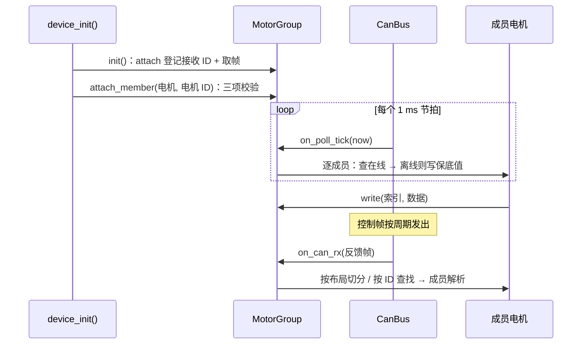
```mermaid
sequenceDiagram
  participant A as device_init()
  participant G as MotorGroup
  participant B as CanBus
  participant M as 成员电机
  A->>G: init()：attach 登记接收 ID + 取帧
  A->>G: attach_member(电机, 电机 ID)：三项校验
  loop 每个 1 ms 节拍
    B->>G: on_poll_tick(now)
    G->>M: 逐成员：查在线 → 离线则写保底值
  end
  M->>G: write(索引, 数据)
  Note over B: 控制帧按周期发出
  B->>G: on_can_rx(反馈帧)
  G->>M: 按布局切分 / 按 ID 查找 → 成员解析
```

**接收共享时的一个物理事实**：反馈若是一帧含多机数据，"某成员单独离线"不可能发生 —— 帧要么整帧到、要么不到。因此该布局下组会把**全部成员**一起 `refresh_task()`，逐成员判离线自然退化为组级判定。**这不是设计缺陷，是帧结构的必然。**

**离线与保底**：规则与单机一致（§2.5），只是由组转发节拍。`SHARED` 发送布局下，
某成员离线只把它的偏移片段写为保底值，其余成员不受影响。

---

## 4. 三步实施

### 4.1 第一步：设备表 + 帧表 + 分发

**目标**：删掉 `CanRxNode` / `CanTxNode` 两个类与自由注册函数，换成设备表与帧表；发送周期从总线的全局 5 ms 常量变成帧自己的属性；设备的离线保护接入已有的 `Online`。

**本步不做**：`probe`、延迟探测、`Status::RETRY`、事务表、电机组（均无真实用户，见 §0 决策 17 / 20）。

**动作清单**

| # | 动作 | 文件 |
| --- | --- | --- |
| 1 | 新增设备接口（**两个虚函数**）与接收 ID 描述 | 新增 `Service/can_device.hpp` |
| 2 | 新增帧对象（数据 + 意图 + 周期 + 锁，**单写者整体 8 字节**） | 新增 `Service/can_frame.hpp` / `.cpp` |
| 3 | 重写总线：设备表、帧表、`attach/detach`、`frame()`、`tx_recover()`、`service_recovery()`、新 `rx_poll` / `tx_poll`；**删除回退缓冲与 `receive()`** | `Service/can_bus.hpp` / `.cpp` |
| 4 | 删除两个节点类与自由注册函数 | 删除 `Service/can_rx_node.*`、`Service/can_tx_node.*` |
| 5 | 删掉 `CanBus::frozen`，登记判据统一为 `sys_flag_running()` | `Service/can_bus.*` |
| 6 | 设备改造：继承设备接口、实现 `on_can_rx` 与 `on_poll_tick`、用帧表写数据、**保留已有的 `Online` 成员**（阈值改 50 ms）、析构里 `detach()`、删掉节点指针与静态回调 | `Device/dji_motor.hpp` / `.cpp` |
| 7 | `sys_task` 改为调用总线封装的 `tx_recover()` / `service_recovery()` | `App/task/sys_task.cpp` |
| 8 | 测试登记点改造 | `App/test/can/can_recovery_test.cpp` |

> **电机组不在第一步**：当前两个电机各占一条独立控制帧（0x200 / 0x1FE），尚无需共帧。
> 四轮底盘接入时再建电机组类；届时总线层不需要任何改动。

**发送调度判决（新 `tx_poll`）**

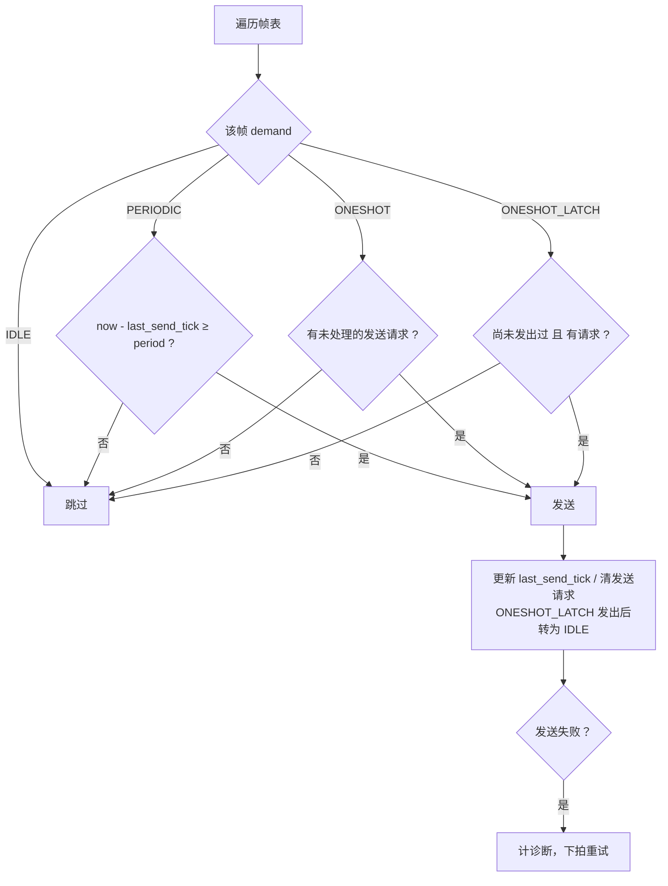
```mermaid
flowchart TD
  A["遍历帧表"] --> B{"该帧 demand"}
  B -->|IDLE| Z["跳过"]
  B -->|PERIODIC| C{"now - last_send_tick ≥ period ?"}
  B -->|ONESHOT| D{"有未处理的发送请求 ?"}
  B -->|ONESHOT_LATCH| L{"尚未发出过 且 有请求 ?"}
  C -->|是| H["发送"]
  C -->|否| Z
  D -->|是| H
  D -->|否| Z
  L -->|是| H
  L -->|否| Z
  H --> I["更新 last_send_tick / 清发送请求<br/>ONESHOT_LATCH 发出后转为 IDLE"]
  I --> J{"发送失败？"}
  J -->|是| K["计诊断，下拍重试"]
```

**验证判据**

| 类别 | 判据 | 执行者 |
| --- | --- | --- |
| 编译 | `cmake --build build/Debug` 无 warning / 无 error | 本会话 |
| 主机测试 | `python3 User/App/test/can/test_recovery_host.py` 输出 `PASS` | 本会话 |
| 静态检查 | 全仓无 `regist(` / `unregist(` / `CanRxNode` / `CanTxNode` 残留 | 本会话 |
| **实机** | 置 `APP_TEST_CAN3_DEVICE_ENABLED=1`，观察：两路反馈 `samples` 持续增长、诊断计数为 0、`rpm` 极值与方向正确、`sys_task` 单轮耗时无明显变化 | **开发者**（本会话禁止烧录） |

**回滚**：本步在独立分支上进行；`can_rx_node.*` / `can_tx_node.*` 在提交历史中可完整取回。

### 4.2 第二步：流式能力完整化

**目标**：接第一个真实传感器时，把"流式"这一侧的完整能力补齐。

**动作清单**

| # | 动作 | 说明 |
| --- | --- | --- |
| 1 | 设备级收发统计 | 每设备：收帧数、拒收数、超时次数，并入 `diagnostics` |
| 2 | 在线判定统一到 `Online` | 所有设备复用已有 `Online`（构造即注册、sys_task 统一推进）；阈值统一 50 ms |
| 3 | 未认领帧统计 | 未被任何设备认领的帧（第一步已计 `rx_unclaimed`，本步汇入总线级诊断报表） |
| 4 | 帧级发送统计 | 每帧：发送次数、失败次数、兜底触发次数 |
| 5 | 传感器接入示例 | 用传感器 A / B 的形态验证：只收、周期查询两种 |
| 6 | `probe()` + 延迟探测 | 引入 `Status::RETRY`、设备启动阶段、总线的延迟重试（含上限）—— **接入需要"配置成功才转流式"的设备时再加** |

**验证判据**：编译无告警；实机看统计量随预期增长、拔掉设备后在线判定在一个超时周期内翻为离线。

### 4.3 第三步：事务表（应答配对）

**目标**：接主控通讯时加入"投递确认"。**必须等真实协议在手再做**，否则匹配规则会设计错。

**事务结构**

| 字段 | 含义 |
| --- | --- |
| `frame` | 引用哪条帧 |
| `ack_id` | 期待的应答帧 ID |
| `timeout_ms` | 应答超时 |
| `retry_max` / `retry_left` | 最大重试次数 / 剩余 |
| `state` | 空闲 / 等待中 / 成功 / 失败 |
| `user_tag` | 给设备使用的标记（命令码、序号等） |

**匹配边界（本设计的原则）**：总线只做 **ID 配对 + 超时 + 重试**，绝不解析帧内容。帧内容是否"真的是这次请求的应答"由设备判断（例如校验寄存器号、命令码、序号）；设备判断不通过就不确认，总线继续按超时重发。

**分发顺序**：事务匹配只负责**结束等待状态**，帧本身**照样交给设备解析**（设备本来就需要读应答里的数据）。

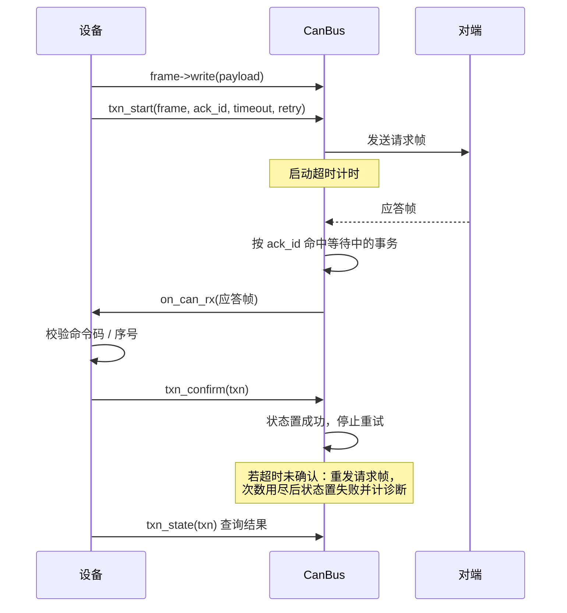
```mermaid
sequenceDiagram
  participant D as 设备
  participant B as CanBus
  participant P as 对端
  D->>B: frame->write(payload)
  D->>B: txn_start(frame, ack_id, timeout, retry)
  B->>P: 发送请求帧
  Note over B: 启动超时计时
  P-->>B: 应答帧
  B->>B: 按 ack_id 命中等待中的事务
  B->>D: on_can_rx(应答帧)
  D->>D: 校验命令码 / 序号
  D->>B: txn_confirm(txn)
  B->>B: 状态置成功，停止重试
  Note over B: 若超时未确认：重发请求帧，<br/>次数用尽后状态置失败并计诊断
  D->>B: txn_state(txn) 查询结果
```

**验证判据**：编译无告警；实机验证超时重发次数与最终失败上报；对端断开时业务能看到失败而不是永久等待。

### 4.4 后续（按需）：电机组

**不属于上面三步**。触发条件是"某条总线上出现共帧"，当前最可能是四轮底盘接入多个同类电机时。

| 动作 | 文件 |
| --- | --- |
| 新增电机组与成员接口（四种收发组合，见 §3.1） | 新增 `Device/motor_group.hpp` / `.cpp` |
| 组挂总线（登记接收 ID + 取帧），成员挂组 | `Device/device_cfg.cpp` |
| **总线层不需要任何改动** | — |

**实机判据**：四个电机共用一条控制帧时，各电机独立响应；单个电机拔线只影响它自己的输出片段。

---

## 5. 时序图集

### 5.1 电机（周期控制 + 周期反馈）

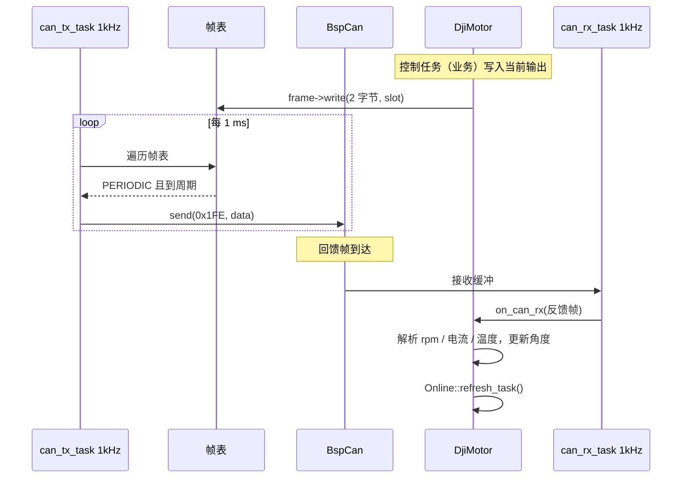
```mermaid
sequenceDiagram
  participant T as can_tx_task 1kHz
  participant F as 帧表
  participant B as BspCan
  participant D as DjiMotor
  participant R as can_rx_task 1kHz

  Note over D: 控制任务（业务）写入当前输出
  D->>F: frame->write(2 字节, slot)
  loop 每 1 ms
    T->>F: 遍历帧表
    F-->>T: PERIODIC 且到周期
    T->>B: send(0x1FE, data)
  end
  Note over B: 回馈帧到达
  B->>R: 接收缓冲
  R->>D: on_can_rx(反馈帧)
  D->>D: 解析 rpm / 电流 / 温度，更新角度
  D->>D: Online::refresh_task()
```

### 5.2 传感器 C（配置事务 → 转流式，**第二步**）

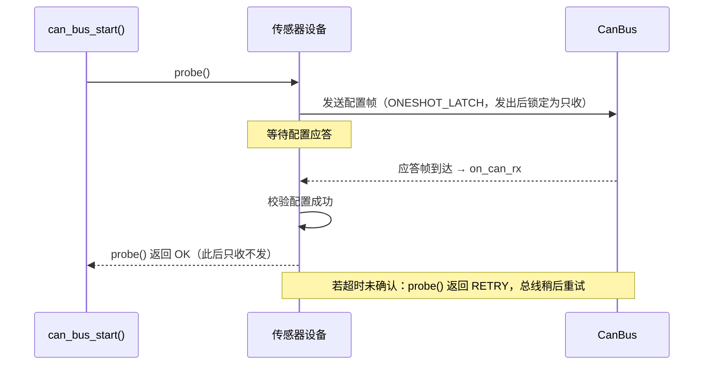
```mermaid
sequenceDiagram
  participant S as can_bus_start()
  participant D as 传感器设备
  participant B as CanBus
  S->>D: probe()
  D->>B: 发送配置帧（ONESHOT_LATCH，发出后锁定为只收）
  Note over D: 等待配置应答
  B-->>D: 应答帧到达 → on_can_rx
  D->>D: 校验配置成功
  D-->>S: probe() 返回 OK（此后只收不发）
  Note over D,B: 若超时未确认：probe() 返回 RETRY，总线稍后重试
```

### 5.3 主控通讯（双向 + ACK）

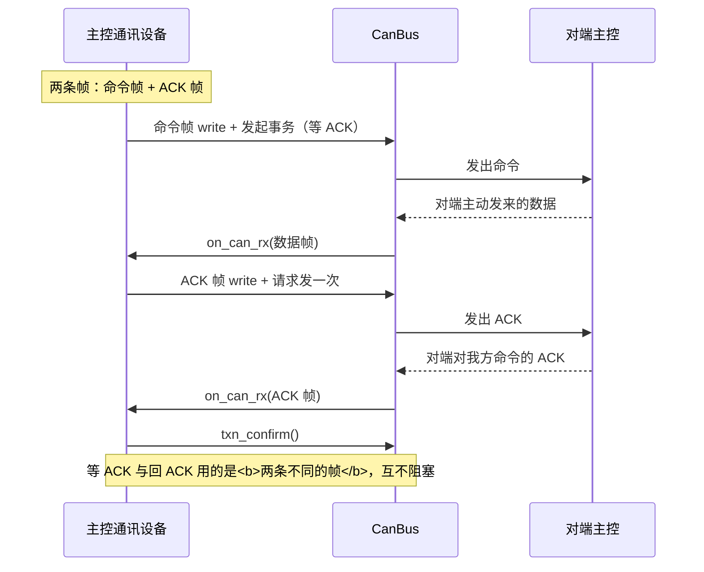
```mermaid
sequenceDiagram
  participant D as 主控通讯设备
  participant B as CanBus
  participant P as 对端主控
  Note over D: 两条帧：命令帧 + ACK 帧
  D->>B: 命令帧 write + 发起事务（等 ACK）
  B->>P: 发出命令
  P-->>B: 对端主动发来的数据
  B->>D: on_can_rx(数据帧)
  D->>B: ACK 帧 write + 请求发一次
  B->>P: 发出 ACK
  P-->>B: 对端对我方命令的 ACK
  B->>D: on_can_rx(ACK 帧)
  D->>B: txn_confirm()
  Note over D,B: 等 ACK 与回 ACK 用的是<b>两条不同的帧</b>，互不阻塞
```

### 5.4 一个 1 ms 节拍内两个任务各做什么

```mermaid
gantt
  title 1 kHz 节拍内的分工（示意，非实测）
  dateFormat X
  axisFormat %s
  section can_rx_task 优先级 +8
  取帧并分发 :0, 1
  未命中帧计诊断丢弃 :1, 1
  section can_tx_task 优先级 +8
  遍历帧表判该不该发 :2, 1
  发送入队 :3, 1
  section sys_task 优先级 +7（10 ms）
  总线补发与恢复巡检 :4, 1
```

### 5.5 电机离线 → 归零保护

```mermaid
sequenceDiagram
  participant B as CanBus（1 kHz）
  participant D as DjiMotor
  participant P as 电调
  Note over D,P: 正常：反馈持续到达
  P-->>D: 反馈帧（每 1 ms）
  Note over P: 反馈中断
  D->>D: on_poll_tick：距上次反馈 ≥ 50 ms → 判离线
  D->>B: frame->write(归零内容)（覆盖业务值）
  B->>P: 周期帧继续发送，内容为零
  Note over D: 离线期间 fill_data() 一律返回 TIMEOUT
  P-->>D: 反馈恢复
  D->>D: 退出离线，恢复接受业务写入
```

---

## 6. 触及面清单

### 6.1 代码

| 类别 | 文件 |
| --- | --- |
| 新增 | `User/Service/can_device.hpp`、`User/Service/can_frame.hpp`、`User/Service/can_frame.cpp` |
| 重写 | `User/Service/can_bus.hpp`、`User/Service/can_bus.cpp` |
| 删除 | `User/Service/can_rx_node.hpp/.cpp`、`User/Service/can_tx_node.hpp/.cpp` |
| 修改 | `User/Device/dji_motor.hpp/.cpp`、`User/Device/device_cfg.cpp`、`User/App/task/sys_task.cpp`、`User/App/test/can/can_recovery_test.cpp` |
| 不变 | `User/Service/service_cfg.*`、`User/Bsp/bsp_can.*`、`User/CMakeLists.txt`（`GLOB_RECURSE` + `CONFIGURE_DEPENDS`，增删文件无需改） |
| 后续（按需） | 新增 `User/Device/motor_group.hpp` / `.cpp`（电机组，见 §3.1） |

### 6.2 现存登记与外部访问点（须全部改造）

| 位置 | 现状 | 改造后 |
| --- | --- | --- |
| `dji_motor.cpp:220` | 注册发送槽位 | 取帧（不再占槽位） |
| `dji_motor.cpp:232` | 注册接收节点 | `attach()` 登记接收 ID |
| `dji_motor.cpp:149/161/236` | 注销节点 | `detach()` |
| `can_recovery_test.cpp:206` | 注册接收节点 | `attach()` |
| `sys_task.cpp:37-38` | 直接读 `bus._can` 调恢复 | `bus.tx_recover()` / `bus.service_recovery()` |
| `can3_device_test.cpp:117` | 用 `bus_can3.receive()` 排空回退缓冲 | 删除该行；未认领帧改看 `rx_unclaimed` 计数 |

### 6.3 文档

| 文件 | 需同步内容 |
| --- | --- |
| `Docs/spec/分层架构.md` | 分层表与实例表中的节点类条目、CAN 时序图 |
| `Docs/guide/项目结构.md` | Service 目录条目 |
| `README.md` | 分层图 |
| `User/App/test/can/README.md` | 测试说明（含已过时的"抽取 `tx_available()`"描述） |

---

## 7. 风险与对策

| 风险 | 触发条件 | 对策 |
| --- | --- | --- |
| 登记时机失控 | 运行期仍能登记 | 只保留一个登记入口，入口内判 `sys_flag_running()`（已删 `frozen`，见 §1.8） |
| 析构顺序错误 | 设备先销毁、总线仍持有指针 | 设备析构必须先 `detach`；冻结后 `detach` 返回 `NOT_SUPPORTED` 并由上层断言 |
| 帧竞争 | 设备写帧、发送任务同时读快照 | 帧为单写者；锁只保护"写入 / 取快照"，临界区内只做 `memcpy`，发送在锁外 |
| 发送任务启动快照 | 启动时无帧则任务自杀 | 帧在 `device_init()` 阶段全部建好；任务改为"无帧时不退出"以免后续无法启用 |
| 主机测试脚本失效 | 改动 `BspCan::service_recovery()` 签名或 `bus_usable` 局部量名 | 本计划不改这两处；改后必须重跑脚本 |
| 事务匹配越界 | 总线开始解析帧内容 | 匹配只做 ID 配对；内容匹配一律由设备判断 |
| 表容量不足 | 设备数增长 | 容量为编译期常量，溢出记初始化错误（`FULL`），不做动态扩容 |
| 实机回归不足 | 只跑编译 | 第一步与第三步各有实机判据，须由开发者执行 |
| 离线期间业务侧积分累积 | 离线 50 ms 后恢复，PID 积分已累积 | 业务侧在离线时停止积分；设备在恢复后首拍仍输出归零 |
| 归零被业务覆盖 | 业务任务每拍写控制量 | 离线期间设备内部强制写归零，`fill_data()` 返回 `TIMEOUT` 供业务感知 |

---

## 8. 验证清单

| # | 项 | 判据 | 执行者 |
| --- | --- | --- | --- |
| 1 | 全量重编 | `rm -rf build/Debug && cmake --preset Debug && cmake --build build/Debug`，0 warning / 0 error | 本会话 |
| 2 | 主机状态机测试 | `test_recovery_host.py` 输出 `PASS` | 本会话 |
| 3 | 残留引用 | 全仓无 `CanRxNode` / `CanTxNode` / `regist(` / `unregist(` | 本会话 |
| 4 | 公开面收口 | `CanBus` 的 `_can` 为私有；`rx_head` / `tx_head` / `_rx_return_buffer` 随节点类与回退缓冲一起消失 | 本会话 |
| 5 | 内存占用 | 记录 FLASH / DTCMRAM 变化，与改造前（FLASH 121576 B、DTCMRAM 65120 B）对比 | 本会话 |
| 6 | 实机：双电机自检 | 反馈持续、诊断计数为 0、方向正确 | 开发者 |
| 7 | 实机：Bus-Off 恢复 | `can_recovery_test` 通过（须与电机测试分时进行，二者共用 CAN1） | 开发者 |
| 8 | 实机：离线归零 | 拔掉电机 CAN 线：50 ms 内该电机输出归零且 `fill_data()` 返回 `TIMEOUT`；恢复接线后重新接受控制 | 开发者 |

---

## 9. 与编码规范的对齐

本计划新增代码须满足（摘自 `Docs/spec/编码规范.md`）：

- `.cpp` 顶部**不写**文件说明块，`#include` 直接开始；`.hpp` 必须有 `@file` 块。
- 类/结构体/枚举**不加 `_t` 后缀**；私有成员与私有函数用 `_` 前缀；宏与常量全大写蛇形。
- 构造函数**只做赋值**；所有 RTOS 资源创建与注册动作放 `init()`。
- 禁止 `friend`；类外需要访问就设成 public 接口。
- 分区横幅成对出现、**禁止嵌套**、二级注释不用横幅形式。
- `///<` 只允许出现在成员声明的**同一行行尾**。
- 参数达到 3 个及以上时收进类内 `Config` 结构体，调用处用匿名按序传参。

---

## 10. 待办勾选

- [ ] 第一步：设备表 + 帧表 + 分发
- [ ] 第一步：设备节拍钩子 + 离线强制归零（安全功能）
- [ ] 第一步：设备节拍钩子 + 离线强制归零（安全功能）
- [ ] 第一步实机验证（双电机自检）
- [ ] 第二步：流式能力完整化
- [ ] 第三步：事务表（应答配对 + 超时 + 重试）
- [ ] 文档同步（分层架构 / 项目结构 / 测试说明 / 根 README）
- [ ] 后续（按需）：电机组（四种收发组合，见 §3.1）
