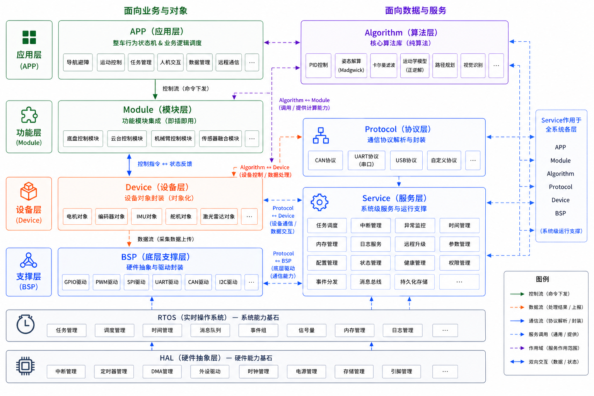
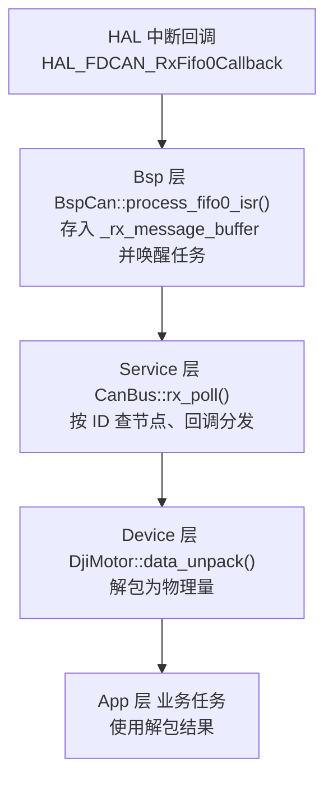

# 分层架构

## 依赖方向

```txt
App（应用层，api_xxx 转接）
 └─ Module（模块层，多设备组合）
     └─ Device（设备层，单设备驱动）
         └─ Bsp（板载支持包，不考虑上层硬件细节）
```

- 依赖单向：上层可以使用下层，**禁止反向依赖**。判断方法很简单——下层文件里不应出现上层的头文件。
- `Service` / `Algorithm` / `Protocol` 不属于这条主链，以工具库、服务的形式贯穿各层。
- 跨层通信只使用下一层暴露的全局实例，不直接操作 HAL。



## 各层职责

| 层 | 职责 | 典型内容 |
| --- | --- | --- |
| App | 任务创建与业务编排；C/C++ 转接 | `api_main`（`all_init()` / `StartDefaultTask`）、`task/`、`test/` |
| Module | 由多个设备组合而成的模块 | 当前为空 |
| Device | 单设备驱动 | `dji_motor_group`（一条总线上的电机组）、`device_buzzer` |
| Bsp | 板载支持包：只认识外设，不认识业务 | `bsp_can`、`bsp_uart`、`bsp_dwt`、`bsp_key`、`bsp_gpio`、`bsp_pwm` |
| Service | 跨设备公共设施 | `status`（`Status` + `EventState`）、`service_cfg`、`online_check`、`motor_definition` |
| Algorithm | 与硬件无关的算法 | `pid` |
| Protocol | 上位机 / 板间通讯协议 | 当前为空（目录已预留） |

## 全局实例的归属

各层的全局实例集中在同层的 `xxx_cfg.{hpp,cpp}`：实例在 `.cpp` 中定义，`.hpp` 中 `extern`，该层的初始化函数也放在这里。

| 层 | 文件 | 内容 |
| --- | --- | --- |
| Bsp | `bsp_cfg.{hpp,cpp}` | `bsp_can1/2/3`、`bsp_uart1/3/4/5/7/8/9/10`、9 路 `BspGpio`、6 路 `BspPwm`、`key_user`、`bsp_dwt`、`bsp_init()` |
| Service | `service_cfg.{hpp,cpp}` | `sys_state`、`service_init()` |
| Device | `device_cfg.{hpp,cpp}` | `buzzer`（蜂鸣器）、`motor_group`（CAN3 电机组）、`device_init()` |
| Protocol | —（尚无实例） | — |
| App | `api_main.{h,cpp}` | `all_init()` 与 `StartDefaultTask` |

## 一次调用的完整链路

以 CAN 收到一帧电机反馈为例，各层职责如下：



- Bsp 只负责把硬件事件变成「一帧数据」，不认识节点。
- Service 负责「这一帧属于谁」，不认识物理量含义。
- Device 负责「这些字节是什么物理量」，不认识业务。
